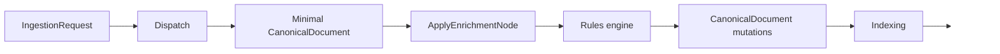

# How to write ingestion rules

This page explains the ingestion rules model used by `UKHO.Search`, how rules are authored, and how they fit into the runtime enrichment pipeline.

The canonical reference for rule semantics is:

- `docs/ingestion-rules.md`

## What rules do

Rules enrich a `CanonicalDocument` using data from the active ingestion payload.

At runtime the engine:

1. determines the provider name
2. selects the active payload (`IndexItem` / add-update style payload in the docs' terminology)
3. evaluates predicates
4. applies all matching actions in deterministic order

Rules are **provider-scoped**. For the current local workflow the main provider is:

- `file-share`

## Where rules live in local development

There are two views of rule storage to understand.

### 1. Authoring source in this repository

For local Aspire development, rule files are currently edited under the repository root:

- `rules/file-share/...`

`AppHost` loads that directory into the configuration emulator under the `rules` prefix when running locally in services mode.

### 2. Historical rules-engine storage design

The rules-engine design history also documents per-rule JSON storage under a `Rules/` root and the runtime schema/workflow in `docs/033-rule-storage/spec.md` and `docs/ingestion-rules.md`.

The important practical point is that the local dev workflow is already using **per-rule JSON files** and a provider-scoped directory layout.

## Rule file shape

A rule file contains:

```json
{
  "schemaVersion": "1.0",
  "rule": {
    "id": "example-rule",
    "context": "example",
    "title": "Example exchange set",
    "if": {
      "properties[\"product\"]": "AVCS"
    },
    "then": {
      "keywords": { "add": ["exchange-set"] }
    }
  }
}
```

Key points:

- `schemaVersion` is required and must be `1.0`
- each file contains exactly one rule
- `rule.id` must be unique within a provider scope
- `rule.title` is required, must be non-empty, and should be concise display-oriented text
- for `file-share`, `context` has special validation rules once the ruleset is uplifted to require it consistently

## Predicate model

Rules support two predicate styles.

### Shorthand AND form

Simple equality checks using a path/value object.

Example:

```json
"if": {
  "properties[\"product\"]": "AVCS",
  "id": "batch-1"
}
```

Every entry must match.

### Explicit boolean form

Use:

- `all`
- `any`
- `not`

Leaf conditions use:

- `path`
- one operator such as `eq`, `exists`, `contains`, `startsWith`, `endsWith`, or `in`

### `exists` semantics

`exists` is a boolean operator.

- `exists: true` matches when the path resolves to at least one retained value
- `exists: false` matches when the path resolves to no retained values

For this operator, a retained value means a resolved value that is not `null`, empty, or whitespace-only.

That means `exists: false` matches not only when a path is missing, but also when it resolves only to empty or whitespace-only values.

For the same payload and path, `exists: false` is equivalent in match outcome to wrapping the same leaf predicate in `not { ... exists: true }`, but the direct boolean form is supported explicitly and is usually clearer to read.

## Path model

Rules evaluate against the active payload.

Important path rules:

- path segment matching is case-insensitive
- collection traversal must use `[*]`
- numeric indexes are not allowed
- missing runtime values do **not** fail ingestion; they simply result in non-match / no output

Examples:

- `files[*].mimeType`
- `files[*].filename`
- `properties["abcdef"]`
- `properties.region`

## Action model

Rules are additive enrichments over `CanonicalDocument`.

After a rule matches, the engine also evaluates the top-level `rule.title` value through the same templating/path-resolution pipeline used by rule actions. That means `rule.title` can use literals, `$val`, and `$path:` expressions.

Supported actions include:

- `keywords.add`
- `searchText.add`
- `content.add`
- `facets.add`
- `documentType.set`
- discovery taxonomy fields such as `authority.add`, `region.add`, `format.add`, `category.add`, `series.add`, `instance.add`, `majorVersion.add`, `minorVersion.add`

String outputs are normalized to trimmed lower-case. Empty results are skipped.

`rule.title` is different from those additive string actions: it is trimmed and deduplicated but preserves display casing when written into `CanonicalDocument.Title`.

## Variables and templating

Rules support:

- `$val`
- `$path:<path>`

This allows actions to reuse matched values or resolve other values from the active payload.

## Parsing operators

`toInt(...)` is the main typed conversion documented today.

Use it when writing into numeric taxonomy fields such as:

- `majorVersion`
- `minorVersion`

If parsing fails, the output is skipped; ingestion does not fail.

## Runtime behavior in the pipeline

Rules are applied as part of the enrichment stage.



The rules engine is designed to be:

- provider-aware
- fail-fast for invalid rule definitions
- tolerant of missing runtime paths

That distinction matters:

- **invalid JSON/schema/path syntax** -> startup/configuration failure
- **missing data in a specific payload** -> rule does not match; outputs are skipped

`rule.title` is part of the fail-fast contract. Missing or blank titles are treated as rule-definition errors and fail startup/configuration loading.

Separately, after enrichment completes, the pipeline validates that the final `CanonicalDocument` retained at least one title value. If no title was produced, the upsert is rejected and routed to the existing dead-letter path instead of being indexed.

## Authoring guidance

### Prefer small focused rules

Keep one rule focused on one enrichment outcome or one closely-related set of outcomes.

### Use shorthand when possible

For simple equality conditions, shorthand rules are easier to read and maintain.

### Use explicit boolean predicates for branching logic

Use `all`, `any`, and `not` when the rule truly needs boolean structure.

When the primary intent is simply to assert that a property is absent, prefer the direct form:

```json
{ "path": "properties[\"agency\"]", "exists": false }
```

rather than the more verbose equivalent `not { path: ..., exists: true }` form.

### Be careful with wildcard paths

Wildcard paths can produce multiple values, which affects:

- `$val`
- multi-valued outputs
- scalar-safety for `documentType.set`

### Normalize expectations

Everything indexed into the discovery surface is expected to be lowercase or normalized by the `CanonicalDocument` API and related mutators.

## RulesWorkbench and rule evaluation

`RulesWorkbench` is the developer tool for inspecting and evaluating rules.

It:

- loads rules through the same runtime rule catalog
- evaluates a sample payload into a `CanonicalDocument`
- shows matched rules and the final document JSON
- includes rule-checker and batch-scan tooling for finding candidate rule coverage

The `Checker` page also validates that the evaluated `CanonicalDocument` retained the required local-workflow fields:

- `Title`
- `Category`
- `Series`
- `Instance`

That keeps local rule-diagnosis feedback aligned with the runtime title contract, even though the checker remains intentionally scoped to the rules path rather than the full ZIP-dependent enrichment chain.

This is the best local feedback loop when authoring or refining rules.

For the stable documented parts of that tool, see [Tools: `RulesWorkbench`](Tools-RulesWorkbench). That page intentionally covers only the `Rules` and `Checker` pages.

## Practical local workflow

1. Edit a rule under `rules/file-share/...`.
2. Start the local services stack.
3. Open `RulesWorkbench` to validate/evaluate the rule.
4. Use `FileShareEmulator` to submit real batches through the ingestion pipeline.
5. Inspect the resulting index documents or dead letters.

## Example authoring checklist

- unique `id`
- non-empty display-oriented `title`
- valid `schemaVersion`
- valid provider placement
- consistent `context` for `file-share`
- paths use `[*]` correctly
- actions only emit intended normalized values
- numeric fields use `toInt(...)` where needed

## Related pages

- [Ingestion pipeline](Ingestion-Pipeline)
- [CanonicalDocument and discovery taxonomy](CanonicalDocument-and-Discovery-Taxonomy)
- [File Share provider](FileShare-Provider)
- [Tools: `RulesWorkbench`](Tools-RulesWorkbench)
- [Documentation source map](Documentation-Source-Map)
