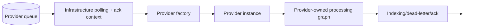
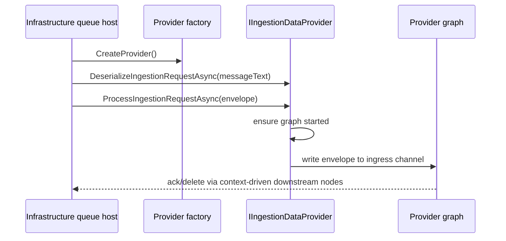

# Ingestion service provider mechanism

The ingestion service is built around a provider abstraction so that queue polling, host wiring, and generic pipeline runtime can remain stable while source-specific processing graphs vary by provider.

The current concrete provider is File Share, but the architecture is intentionally broader than that single implementation.

## Core contracts

### `IIngestionDataProviderFactory`

Defined in:

- `src/UKHO.Search.Ingestion/Providers/IIngestionDataProviderFactory.cs`

Responsibilities:

- expose the provider `Name`
- expose the queue name the infrastructure layer should poll
- create a provider instance

### `IIngestionDataProvider`

Defined in:

- `src/UKHO.Search.Ingestion/Providers/IIngestionDataProvider.cs`

Responsibilities:

- deserialize raw queue message text into `IngestionRequest`
- accept an `Envelope<IngestionRequest>` and process it asynchronously

## Why the abstraction exists

Without a provider abstraction, the ingestion host would need to know too much about:

- queue payload format
- provider-specific processing graphs
- enrichment dependencies
- source-specific dead-letter/indexing behavior

The provider model keeps those details behind a stable boundary.

## Separation of responsibilities

### Infrastructure owns

- queue lifecycle and polling
- queue visibility/poison handling
- queue message ack/deletion plumbing
- client wiring for Azure Queue, Blob, Elasticsearch
- generic dead-letter persistence and indexing adapters

### Provider owns

- message deserialization details
- the long-lived processing graph
- source-specific enrichment and parsing
- how a valid request becomes provider-specific canonical enrichment

## How this shows up in the code

The design history in `docs/008-provider-refactor/architecture.md` describes the intended split clearly:

- infrastructure queue host receives and wraps messages
- provider processes `Envelope<IngestionRequest>` objects
- provider graphs own validation/dispatch/enrichment/batching/index coordination

The File Share factory currently exposes:

- provider name: `file-share`
- queue name: from configuration (`filesharequeuename`)

## Provider metadata and split registration

Provider identity now needs to serve two different composition roots:

- `IngestionServiceHost`, which needs provider runtime services
- `StudioServiceHost`, which only needs provider metadata plus Studio-facing API composition for development-time tooling and Theia integration

Those two hosts must not depend on each other. In particular, `StudioServiceHost` and Theia are development-time-only components and are not expected to be present in live deployments.

The current implementation now centralizes generic provider identity, metadata, catalogs, and registration helpers in `src/UKHO.Search.ProviderModel` so both ingestion and studio composition use the same shared model.

To support that, providers must follow a split-registration model:

- **metadata registration** contributes shared provider metadata such as the canonical provider descriptor
- **runtime registration** contributes the ingestion factory and runtime-only dependencies

This allows:

- `StudioServiceHost` to know about providers by composing provider metadata directly
- `IngestionServiceHost` to compose both metadata and runtime registrations, then validate enabled providers before queue/bootstrap work begins

Studio-side provider behavior is now also modeled separately through `src/Studio/UKHO.Search.Studio` and tandem provider projects such as `src/Providers/UKHO.Search.Studio.Providers.FileShare`, keeping development-time provider logic out of ingestion provider projects and out of `StudioServiceHost` itself.

In the current implementation, the File Share provider exposes split registration so that:

- `AddFileShareProviderMetadata()` is used by `StudioServiceHost`
- `AddFileShareProviderRuntime(...)` is used by ingestion runtime composition

`StudioServiceHost` also composes `AddFileShareStudioProvider()` from the tandem Studio provider package and validates Studio provider registrations against the shared Provider Model at startup.

The ingestion runtime then applies enabled-provider validation before startup proceeds:

- enabled provider names are read from the `ingestion:providers:*` configuration path
- names are matched case-insensitively against provider metadata and runtime registrations
- if no providers are configured, ingestion defaults to all registered runtime providers
- invalid or incomplete provider enablement fails before bootstrap or queue polling begins

See [Provider metadata and split registration](Provider-Metadata-and-Split-Registration) for the formal design guidance.

## Provider startup model

The File Share provider lazily starts its processing graph the first time it processes a request.

That behavior lives in `FileShareIngestionDataProvider`:

- an ingress channel buffers `Envelope<IngestionRequest>` items
- `EnsureProcessingGraphStartedAsync()` builds the graph once
- the provider writes envelopes into the ingress channel

This is a useful pattern because it keeps provider instantiation lightweight until real work arrives.

## Message envelope context

The provider contract uses `Envelope<T>` rather than raw payloads because the envelope carries more than data:

- message id
- key
- timestamp
- attempt count
- pipeline error state
- context items such as the queue acker
- breadcrumb trail for diagnostics

That context is what allows downstream ack/dead-letter nodes to behave correctly without the provider needing to own Azure Queue deletion directly.

For canonical document creation, the envelope context also carries provider-scoped parameters. That is how a generic pipeline can preserve provider identity until `CanonicalDocumentBuilder` sets the immutable `CanonicalDocument.Provider` field.

## Why provider name matters

Provider name is not just labeling. It is used for:

- metrics tagging
- rules scoping
- diagnostic clarity
- selecting provider-specific runtime behavior
- stamping canonical provenance on `CanonicalDocument.Provider`

`ApplyEnrichmentNode` also pushes the provider name into `IIngestionProviderContext` so enrichers and the rules engine can stay provider-aware without hard-coded global state.

Because provider identity is pipeline-owned provenance, developers should not try to model it as user-supplied document metadata. If a canonical document does not have provider context, that is a pipeline contract violation rather than something callers should patch in manually.

## Benefits of this design

### Extensibility

A future provider can plug in by implementing the same factory/provider contracts.

### Testability

Provider graphs can be tested with controlled envelopes/channels rather than needing full host startup.

### Layering discipline

The host and infrastructure layers do not need to know the internal graph topology of every provider.

### Operational consistency

Dead-lettering, metrics, and envelope semantics stay consistent across providers.

## File Share as the reference provider

The File Share provider is the canonical example today because it exercises most of the architecture:

- queue deserialization
- canonical document creation
- rules integration
- ZIP download/extraction
- Kreuzberg content extraction
- S-57 and S-101 geo/text enrichment
- best-effort ZIP skipping

See [File Share provider](FileShare-Provider) for the concrete implementation.

## Conceptual lifecycle

## Related pages

- [Ingestion pipeline](Ingestion-Pipeline)
- [CanonicalDocument and discovery taxonomy](CanonicalDocument-and-Discovery-Taxonomy)
- [File Share provider](FileShare-Provider)
- [Provider metadata and split registration](Provider-Metadata-and-Split-Registration)
