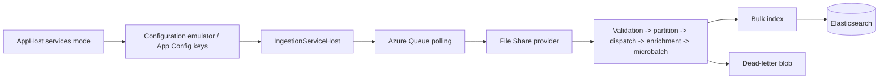

# Ingestion walkthrough

Use this page after reading [Ingestion pipeline](Ingestion-Pipeline) when you want a code-oriented tour of how one File Share message moves through the current repository.

## Reading path

- Start with [Ingestion pipeline](Ingestion-Pipeline) for the conceptual overview and the runtime stage map.
- Read [Ingestion graph runtime foundations](Ingestion-Graph-Runtime) when you want the deeper explanation of the generic node/channel library that the concrete File Share graph is built on.
- Keep [Ingestion rules](Ingestion-Rules) and [Appendix: rule syntax quick reference](Appendix-Rule-Syntax-Quick-Reference) nearby when the walkthrough reaches rules-driven enrichment.
- Use [Ingestion troubleshooting](Ingestion-Troubleshooting) when a stage does not behave as expected.
- Refer back to [Architecture walkthrough](Architecture-Walkthrough), [Project setup](Project-Setup), and [Tools: `RulesWorkbench`](Tools-RulesWorkbench) when you need broader repository or local-tool context.

## One-message mental model

The easiest way to understand ingestion is to follow one queue message from local configuration to Elasticsearch or dead-letter storage.



## 1. AppHost makes the rules and services visible

In normal local development, `src/Hosts/AppHost/AppHost.cs` starts `IngestionServiceHost`, `QueryServiceHost`, `FileShareEmulator`, and `RulesWorkbench` together in `runmode=services`.

A useful ingestion-specific detail lives in the AppHost configuration wiring:

- repository rules are authored under `rules/`
- AppHost mounts that directory into the local configuration emulator under the `rules` prefix
- ingestion and RulesWorkbench both read the same effective rule set from configuration

That means the current local workflow is configuration-backed even though the repository still keeps a file-shaped rule authoring layout.

## 2. Queue ingress stays in infrastructure

Infrastructure owns queue polling, visibility, and acknowledgement plumbing before the provider graph sees anything.

The host/infrastructure boundary is deliberate:

- infrastructure deserializes queue messages and wraps them in `Envelope<IngestionRequest>`
- the envelope carries message id, key, timestamps, retry state, breadcrumbs, and acknowledgement context
- the provider receives a ready-to-process envelope instead of needing to know Azure Queue mechanics

When you are debugging queue mechanics, start in `src/UKHO.Search.Infrastructure.Ingestion` and not in the provider project.

## 3. Provider validation happens before work starts

The ingestion runtime uses `UKHO.Search.ProviderModel` to validate provider identity before bootstrap and queue work proceed.

In practice this means:

- rule entries reference canonical provider names such as `file-share`
- enabled providers are checked against metadata registration and runtime registration
- unknown providers fail fast during load rather than surfacing later as mysterious routing problems

Read [Ingestion service provider mechanism](Ingestion-Service-Provider-Mechanism) and [Provider metadata and split registration](Provider-Metadata-and-Split-Registration) together when you are tracing this startup path.

## 4. The File Share provider owns the long-lived graph

`src/Providers/UKHO.Search.Ingestion.Providers.FileShare/Pipeline/FileShareIngestionProcessingGraph.cs` is the concrete reference graph.

The provider keeps its own ingress channel and lazily starts the graph when work arrives. From there the message flows through stable node boundaries:

1. `IngestionRequestValidateNode`
2. `KeyPartitionNode<T>`
3. `IngestionRequestDispatchNode`
4. `ApplyEnrichmentNode`
5. `MicroBatchNode<T>`
6. bulk indexing and acknowledgement / dead-letter sinks

The lane split matters because ordering is preserved per document key all the way through enrichment and indexing. If you want the generic architectural explanation of what a lane is and why the base runtime uses channels, bounded capacity, and fail-fast supervision, pause here and read [Ingestion graph runtime foundations](Ingestion-Graph-Runtime) before continuing with the concrete File Share path.

## 5. Dispatch creates the minimal `CanonicalDocument`

Dispatch is intentionally cheap.

For an `IndexItem` request it creates the smallest useful `CanonicalDocument`:

- `Id`
- `Provider`
- defensive-copy `Source`
- `Timestamp`

Everything user-searchable is added later by rules or enrichers. That separation is what keeps source mechanics out of the canonical search contract.

See [CanonicalDocument and discovery taxonomy](CanonicalDocument-and-Discovery-Taxonomy) for the field-by-field meaning of that model.

## 6. Enrichment is where File Share behavior becomes interesting

`ApplyEnrichmentNode` resolves all registered `IIngestionEnricher` implementations, runs them in order, and then lets the shared rules engine mutate the same canonical document.

For File Share, that usually combines several inputs:

- scalar source-property keyword extraction
- ZIP download and nested ZIP expansion
- Kreuzberg text extraction
- S-57 or S-101 geo / metadata extraction
- rules-driven title and taxonomy enrichment

A helpful way to think about the stage is:

- code enrichers pull facts out of source material
- rules decide how repository-specific discovery semantics should be stamped onto the canonical model

## 7. Rules use the active payload, not the whole envelope

The rules engine evaluates the active request payload:

- `IndexItem` for add/index flows
- no canonical mutation for `DeleteItem` or `UpdateAcl`

For a matching `IndexItem`, the engine currently materializes these `CanonicalDocument` surfaces:

- `Title`
- `Keywords`
- `SearchText`
- `Content`
- `Authority`
- `Region`
- `Format`
- `Category`
- `Series`
- `Instance`
- `MajorVersion`
- `MinorVersion`

That is why most rule-debugging starts from payload shape and matched values rather than from queue metadata.

## 8. Missing-title validation is a real ingestion failure

After enrichers and rules finish, the pipeline verifies that the final canonical upsert document retained at least one title.

If no title survives:

- the document is marked with `CANONICAL_TITLE_REQUIRED`
- the message goes to the index-operation dead-letter flow
- the document is not indexed

This is one of the most important runtime behaviors to remember while authoring rules. A ruleset that adds keywords but never produces a retained title is not “partially successful”; it is a failed ingestion outcome.

## 9. Microbatching and bulk indexing keep ordering intact

Each lane accumulates a local microbatch before handing it to the Elasticsearch bulk writer.

This design gives the runtime two things at once:

- indexing efficiency through batch writes
- per-key ordering because a slow or retried lane blocks later work for the same key instead of letting updates jump ahead

When you see backlog in one lane, think about document-key skew or downstream indexing slowdown rather than about a global pipeline failure first. In other words, ask whether you are seeing a **hot key** or a lane-blocking retry before assuming the entire graph is unhealthy.

## 10. Dead-letter blobs and diagnostics are first-class outputs

The graph has more than a happy path.

It also emits:

- request dead-letter records for structurally invalid requests
- index dead-letter records for enrichment or indexing failures
- diagnostics records for dispatch and indexing visibility

This makes dead-letter storage a normal debugging surface rather than an exceptional last resort.

## Practical tracing recipes

### Trace one local batch end to end

1. Start the local stack:

   ```powershell
   dotnet run --project src/Hosts/AppHost/AppHost.csproj
   ```

2. Submit or locate a batch in `FileShareEmulator`.
3. Watch `IngestionServiceHost` logs and Aspire metrics.
4. Check whether the batch produced an indexed document, a poison-queue symptom, or a dead-letter blob.
5. If rules look suspicious, switch to [Tools: `RulesWorkbench`](Tools-RulesWorkbench) and replay the payload through the shared rules engine.

### Add or change a rule safely

1. Edit the relevant JSON under `rules/file-share/...`.
2. Restart the services-mode stack so the configuration emulator reloads the repository rules.
3. Use `RulesWorkbench` to validate and inspect the effective rule behavior.
4. Push a real batch through the pipeline if you need to confirm ZIP-dependent enrichment alongside rules.

### Add a provider-specific enricher

1. Start from the File Share provider project, not from host code.
2. Decide whether the new behavior is source extraction, canonical shaping, or both.
3. Prefer adding facts to the canonical model through existing mutators.
4. Use rules only for mapping and classification logic that should stay author-editable.

## Where to look when extending ingestion

| Change you want to make | Start reading here | Then continue to |
|---|---|---|
| New rule or rule fix | [Ingestion rules](Ingestion-Rules) | [Appendix: rule syntax quick reference](Appendix-Rule-Syntax-Quick-Reference) -> [Tools: `RulesWorkbench`](Tools-RulesWorkbench) |
| Queue / startup behavior | [Ingestion service provider mechanism](Ingestion-Service-Provider-Mechanism) | [Ingestion pipeline](Ingestion-Pipeline) |
| File Share enrichment or parsing | [File Share provider](FileShare-Provider) | [CanonicalDocument and discovery taxonomy](CanonicalDocument-and-Discovery-Taxonomy) |
| Runtime failures | [Ingestion troubleshooting](Ingestion-Troubleshooting) | [Metrics in the Aspire dashboard](Metrics-in-the-Aspire-Dashboard) |

## Related pages

- [Ingestion pipeline](Ingestion-Pipeline)
- [Ingestion graph runtime foundations](Ingestion-Graph-Runtime)
- [Ingestion rules](Ingestion-Rules)
- [Appendix: rule syntax quick reference](Appendix-Rule-Syntax-Quick-Reference)
- [Ingestion troubleshooting](Ingestion-Troubleshooting)
- [Ingestion service provider mechanism](Ingestion-Service-Provider-Mechanism)
- [File Share provider](FileShare-Provider)
- [CanonicalDocument and discovery taxonomy](CanonicalDocument-and-Discovery-Taxonomy)
- [Tools: `RulesWorkbench`](Tools-RulesWorkbench)
- [Metrics in the Aspire dashboard](Metrics-in-the-Aspire-Dashboard)
