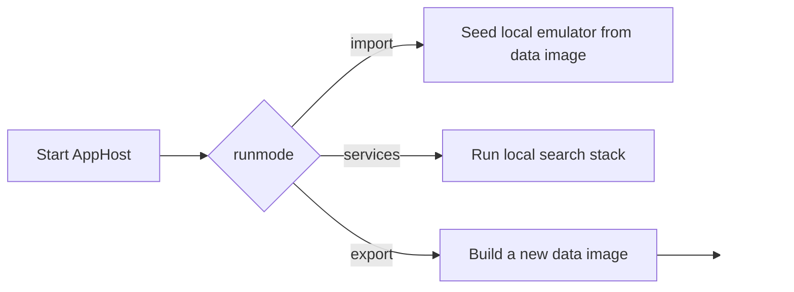

# Project setup

This page explains how to get the local stack running with Aspire, how the data-image workflow works, and how `runmode=import`, `runmode=services`, and `runmode=export` fit together.

## Prerequisites

You need:

- .NET SDKs compatible with the repository (`.NET 10` and ` .NET 9` projects are present)
- Docker Desktop
- local container support for SQL Server, Azurite, Elasticsearch/Kibana, and Keycloak
- Azure CLI for pulling the shared File Share data image from ACR when you are not building your own image
- access to the `AbzuUTL` subscription when using the shared ACR workflow described in `docs/azureacr.md`

Optional but commonly useful:

- Visual Studio with Aspire support
- Elastic/Kibana familiarity for index inspection
- Azure Storage Explorer or similar tools for blobs/queues
- `nvm` / `nvm-windows` when working on the Theia shell so you can switch to the validated Node version quickly

### Additional prerequisites for `UKHO Search Studio`

If you are building the Theia shell in `src/Studio/Server`, also ensure the following are available:

- Node `18.20.4`
- `yarn` classic (`1.x`)
- the globally installed `generator-theia-extension` package
- Visual Studio Build Tools 2022 C++ tooling for native Node module compilation

The current generated Theia stack in this repository was validated with that toolchain combination.

When building from Visual Studio, the `StudioHost` project now triggers the Theia workspace build script before build so a fresh clone can prepare the shell as part of the normal solution build.

## Local orchestration entry point

The local stack is started from:

- `src/Hosts/AppHost/AppHost.csproj`

Default parameters live in:

- `src/Hosts/AppHost/appsettings.json`

Important parameters:

| Parameter | Meaning | Current default |
|---|---|---|
| `environment` | environment label used for data-image naming and blob container naming | `vnext-e2e` |
| `azure-storage` | host path mounted into Azurite | `d:\file-share-emulator` |
| `runmode` | which AppHost workflow to start | `services` |
| `ingestionMode` | ingestion behavior for missing ZIPs | `bestEffort` |

## Understanding `runmode`

`AppHost` supports three run modes.

### `runmode=services`

Starts the main developer stack:

- Azurite (queues, tables, blobs)
- SQL Server
- Keycloak
- Elasticsearch + Kibana
- `IngestionServiceHost`
- `QueryServiceHost`
- `FileShareEmulator`
- `RulesWorkbench`
- `UKHO Search Studio` (Theia shell on `Studio:Server:Port`, default `3000`)
- local configuration emulation that also loads repository rules from `rules/`

Use this mode for day-to-day development and debugging.

Kibana is also available through the Aspire dashboard for Elasticsearch index inspection, index management, and ad-hoc query work.

- sign in as `kibana_admin`
- use the value of the `elastic-password` parameter from the Aspire dashboard **Parameters** tab as the password

### `runmode=import`

Starts the data-image import workflow:

- Azurite
- SQL Server
- a one-shot data seeder container that copies the local Docker image contents into a named volume
- `FileShareImageLoader` as an explicit-start resource

Use this when you already have a local Docker image named `fss-data-<environment>` and want to seed the emulator database/blob content.

### `runmode=export`

Starts the advanced data-image build workflow:

- SQL Server
- `FileShareImageBuilder` as an explicit-start resource

Use this only when creating a new data image from a remote File Share environment. See [Tools (advanced): `FileShareImageBuilder`](Tools-Advanced-FileShareImageBuilder).

## Getting the shared data image from ACR

Use the `searchacr` registry for the shared File Share data image.

### Pull workflow

1. Sign in to Azure:
   - `az login`
2. Log in to the ACR:
   - `az acr login --name searchacr`
3. When `az login` lists available subscriptions, select `AbzuUTL`.
4. Pull the shared image:
   - `docker pull searchacr.azurecr.io/fss-data-vnext-e2e:latest`
5. Retag it to the local image name expected by AppHost:
   - `docker tag searchacr.azurecr.io/fss-data-vnext-e2e:latest fss-data-vnext-e2e:latest`
6. Remove the fully-qualified tag after retagging:
   - `docker rmi searchacr.azurecr.io/fss-data-vnext-e2e:latest`

### Push workflow

Use this when you have built or refreshed the local image and need to publish it back to ACR.

1. Sign in to Azure:
   - `az login`
2. Log in to the ACR:
   - `az acr login --name searchacr`
3. When `az login` lists available subscriptions, select `AbzuUTL`.
4. Ensure you are PIM'ed on the subscription before pushing.
5. Tag the local image with the registry name:
   - `docker tag fss-data-vnext-e2e:latest searchacr.azurecr.io/fss-data-vnext-e2e:latest`
6. Push the image:
   - `docker push searchacr.azurecr.io/fss-data-vnext-e2e:latest`

The key rule is that the local image name must match the AppHost convention:

- `fss-data-<environment>`

So if `environment` is `vnext-e2e`, the loader expects:

- `fss-data-vnext-e2e`

## Recommended local workflow

### First-time or refresh workflow

1. Pull the shared data image from ACR, or build one yourself.
2. Set `runmode` to `import`.
3. Start `AppHost`.
4. In the Aspire dashboard, explicitly start `FileShareLoader`.
5. Wait for the import to complete.
6. Stop the import-mode run.
7. Set `runmode` to `services`.
8. Start `AppHost` again.
9. Open `FileShareEmulator`, `RulesWorkbench`, and the Aspire dashboard.

For rule authoring and rule diagnostics after startup, use [Tools: `RulesWorkbench`](Tools-RulesWorkbench).

### Why import and services are separate

The separation keeps the expensive seeding workflow distinct from the normal dev loop:

- `import` prepares local SQL/blob state from the data image
- `services` runs the actual stack against that prepared state

## What import mode actually does

In `AppHost` import mode:

1. A named Docker volume is created/mounted for emulator data.
2. A data seeder container copies `/data` from the image into that volume if it is empty.
3. `FileShareImageLoader` reads `/data/<environment>.bacpac` and imports the metadata database.
4. `FileShareImageLoader` migrates the local metadata schema as needed.
5. `FileShareImageLoader` imports blob content into the blob container named after the `environment` value.

## Running the stack in services mode

With `runmode=services`:

1. Start `AppHost`.
2. Open the Aspire dashboard.
3. Confirm that `IngestionServiceHost`, `QueryServiceHost`, `FileShareEmulator`, `RulesWorkbench`, storage, SQL, and Elasticsearch are healthy.
4. Confirm that `UKHO Search Studio` is healthy and bound to the configured local port.
5. Open `UKHO Search Studio` with `http://localhost:3000`.
6. Use `FileShareEmulator` to inspect statistics and queue batches for ingestion.
7. Open Kibana from the Aspire dashboard when you need Elasticsearch index inspection, management, or query access.
8. Sign in to Kibana as `kibana_admin` using the `elastic-password` value from the Aspire dashboard **Parameters** tab.
9. Watch Aspire metrics and logs while indexing occurs.

## Building the Theia shell workspace

The Theia shell lives in:

- `src/Studio/Server`

Recommended local build flow:

1. Switch to the validated Node version:
   - `nvm use 18.20.4`
2. Ensure `yarn` is available:
   - `yarn --version`
3. Restore dependencies from `src/Studio/Server`:
   - `yarn install --ignore-engines`
4. Build the browser shell:
   - `yarn build:browser`

For more detail, see [Tools: `UKHO Search Studio`](Tools-UKHO-Search-Studio).

### Automatic build from Visual Studio

If you build the solution in Visual Studio, `src/Studio/StudioHost/StudioHost.csproj` runs `src/Studio/Server/build.ps1` before build.

That integration is incremental, so the script is intended to run only when relevant Theia workspace inputs have changed or when the shell has not yet been built on a fresh clone.

When `AppHost` starts the JavaScript shell resource, Aspire may still show a separate installer resource for the Theia workspace. On a fresh clone or after dependency changes, that installer step can noticeably increase startup time.

## Configuration behavior in local Aspire

### Repository rules

In local run mode, `AppHost` loads the repository `rules/` directory into the configuration emulator with the prefix `rules`.

That means the local workflow is:

- edit rule JSON under `rules/file-share/...`
- run the services stack
- consume those rules through the configuration emulator and runtime rule services

### External services

`configuration/external-services.json` maps local `FileShare` traffic back to `FileShareEmulator` when using the local environment profile.

### Ingestion mode

`IngestionServiceHost` reads the environment variable `ingestionmode` and converts it into an `IngestionModeOptions` singleton.

- `Strict` preserves fail-fast ZIP behavior
- `BestEffort` allows missing ZIPs to be skipped when the failure is specifically treated as "not found"

## Useful post-start checks

- `FileShareEmulator` home page shows metadata statistics.
- `FileShareEmulator` indexing page can submit batches, clear queues, and delete indexes.
- Kibana is reachable from the Aspire dashboard for inspecting indexes, running queries, and checking Elasticsearch state.
- Kibana credentials are `kibana_admin` plus the `elastic-password` parameter value from the Aspire dashboard **Parameters** tab.
- Aspire metrics show the custom ingestion meter described in `docs/metrics.md`.
- dead-letter blobs appear under the configured dead-letter container/prefix.

## Common pitfalls

### The loader cannot find the image

Check that the local Docker image name exactly matches `fss-data-<environment>`.

### You changed `environment`

Keep these in sync:

- AppHost `Parameters:environment`
- the local Docker image tag
- the blob container name created by the loader
- the `.bacpac` filename inside the image

### You skipped import mode

If SQL/blob storage has not been seeded, the emulator may start but have no meaningful data.

### You expected import mode to run automatically

`FileShareLoader` is configured with explicit start. Start it from the Aspire dashboard.

### `UKHO Search Studio` looks healthy in Aspire but the browser still fails

Check that you are opening:

- `http://localhost:3000`

and not:

- `https://localhost:3000`

The current Theia shell endpoint is HTTP-only.

### `UKHO Search Studio` startup is slow because of the installer step

The Aspire JavaScript integration may run a companion installer resource for the Theia workspace.

This is most noticeable:

- on a fresh clone
- after changes to `package.json` or `yarn.lock`
- when the local JavaScript dependency restore state is missing

If the workspace has already been restored and built, subsequent startups should normally be faster.

## Related pages

- [Tools: `FileShareImageLoader` and `FileShareEmulator`](Tools-FileShareImageLoader-and-FileShareEmulator)
- [Tools (advanced): `FileShareImageBuilder`](Tools-Advanced-FileShareImageBuilder)
- [Tools: `RulesWorkbench`](Tools-RulesWorkbench)
- [Ingestion pipeline](Ingestion-Pipeline)
