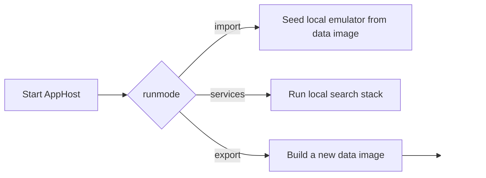

# Project setup

Use this page as the narrative entry point for the local developer environment.

It explains what the setup flow is trying to achieve, how `AppHost` orchestrates the repository, and why the setup story is intentionally split between overview, walkthrough, troubleshooting, and exact-command reference material.

## Setup reading path

- Read this page first for the concepts, prerequisites, and run-mode model.
- Continue to [Setup walkthrough](Setup-Walkthrough) for the step-by-step execution path.
- Use [Setup troubleshooting](Setup-Troubleshooting) if the local environment does not behave as expected.
- Keep [Appendix: command reference](Appendix-Command-Reference) nearby when you need the exact operational commands without extra narrative around them.

This split is deliberate. The setup story in this repository is too broad to fit well on one page without becoming either overwhelming or overly terse. Contributors need one page that explains the shape of the local environment and why the workflow is divided into different loops, one page that gives the practical bring-up sequence, one page that helps diagnose the common failure modes, and one page that preserves verbatim-sensitive commands. Treat those pages as one setup chapter sequence rather than as disconnected notes.

## What setup is assembling locally

The local setup is not just a single web app launch.

It prepares a complete developer environment around the ingestion and query flows, including seeded File Share data, supporting infrastructure, and the tools that make indexing, rule authoring, and observability practical.

That broader scope is the reason setup documentation needs more than a short prerequisite checklist. A contributor who only starts a host process without understanding the seeded data flow, the auth surface, the queue-backed ingestion path, and the local diagnostic tools can end up with a seemingly healthy environment that is still missing the conditions required for useful work.

The main local orchestration entry point is:

- `src/Hosts/AppHost/AppHost.csproj`

Default parameters live in:

- `src/Hosts/AppHost/appsettings.json`

## What new contributors most often miss

The most common onboarding mistake is assuming that local setup is complete as soon as `AppHost` starts. In practice, a productive local environment depends on several aligned pieces:

- the local Docker image has to match the chosen `environment`
- import mode has to seed SQL and blob state before the normal services loop is useful
- services mode has to bring up Keycloak, Elasticsearch, the emulator, and rules tooling together
- post-start checks have to confirm that the environment is not just running, but running with meaningful data and reachable auth

If any of those pieces is missing, later debugging often turns into a false search for an ingestion or UI bug when the real problem is still local setup state.

## Prerequisites

You need:

- .NET SDKs compatible with the repository (`.NET 10` and ` .NET 9` projects are present)
- Docker Desktop
- local container support for SQL Server, Azurite, Elasticsearch/Kibana, and Keycloak
- Azure CLI for pulling the shared File Share data image from ACR when you are not building your own image
- access to the `AbzuUTL` subscription when using the shared ACR workflow described in `docs/azureacr.md`

Optional but commonly useful:

- Visual Studio with Aspire support
- Elastic/Kibana familiarity for index inspection
- Azure Storage Explorer or similar tools for blobs/queues

## Local orchestration model

The most important local parameters are:

| Parameter | Meaning | Current default |
|---|---|---|
| `environment` | environment label used for data-image naming and blob container naming | `vnext-e2e` |
| `azure-storage` | host path mounted into Azurite | `d:\file-share-emulator` |
| `runmode` | which AppHost workflow to start | `services` |
| `ingestionMode` | ingestion behavior for missing ZIPs | `bestEffort` |

Those settings matter because the data image, blob container, and runtime behaviour all line up around the same local environment label and startup mode.

## Understanding `runmode`

`AppHost` supports three run modes.

Those modes are separated because they serve different operational goals. Import mode mutates local state and is therefore intentionally explicit. Services mode is the fast day-to-day loop and should stay lightweight enough for repeated edit-run-debug use. Export mode is an advanced maintenance path for producing a new reusable data image and should stay out of the normal contributor journey. Reading the modes this way makes the setup flow easier to reason about than treating them as three arbitrary switches.

### `runmode=services`

This is the normal day-to-day developer stack.

It starts:

- Azurite (queues, tables, blobs)
- SQL Server
- Keycloak
- Elasticsearch + Kibana
- `IngestionServiceHost`
- `QueryServiceHost`
- `FileShareEmulator`
- `RulesWorkbench`
- local configuration emulation that also loads repository rules from `rules/`

Use this mode for daily development, debugging, index inspection, and rule iteration after the local data baseline already exists.

### `runmode=import`

This mode prepares the local baseline that the services stack later uses.

It starts:

- Azurite
- SQL Server
- a one-shot data seeder container that copies the local Docker image contents into a named volume
- `FileShareImageLoader` as an explicit-start resource

Use this mode when you already have a local Docker image named `fss-data-<environment>` and want to seed the emulator database and blob content.

### `runmode=export`

This is the advanced image-building workflow.

It starts:

- SQL Server
- `FileShareImageBuilder` as an explicit-start resource

Use this mode only when you are intentionally creating a new data image from a remote File Share environment. For that deeper workflow, see [Tools (advanced): `FileShareImageBuilder`](Tools-Advanced-FileShareImageBuilder).

## How the setup journey fits together

The setup experience is intentionally split into two loops.

### First-time or refresh loop

Start with a known image, run the import workflow, and then switch into `services` mode.

This gives the emulator, local storage, and downstream tooling a seeded baseline that reflects the chosen `environment`.

### Day-to-day development loop

After the local machine has seeded SQL and blob state, most work stays in `runmode=services`.

That shorter loop keeps the expensive import path separate from the normal edit-run-debug cycle.

This split is one of the main pieces of setup rationale to preserve. The repository is trying to make realistic seeded data available without forcing every contributor to rebuild or reseed the world every time they want to test a change. The local image and import path carry the expensive state preparation cost so the normal services-mode workflow can stay focused on application behavior, rule iteration, and diagnostics.

## What import mode actually does

In `AppHost` import mode:

1. A named Docker volume is created or mounted for emulator data.
2. A data seeder container copies `/data` from the image into that volume if it is empty.
3. `FileShareImageLoader` reads `/data/<environment>.bacpac` and imports the metadata database.
4. `FileShareImageLoader` migrates the local metadata schema as needed.
5. `FileShareImageLoader` imports blob content into the blob container named after the `environment` value.

That sequence is why the image name, `environment`, and blob naming all have to stay aligned.

## Configuration behavior in local Aspire

### Repository rules

In local run mode, `AppHost` loads the repository `rules/` directory into the configuration emulator with the prefix `rules`.

That means the normal local rule workflow is:

- edit rule JSON under `rules/ingestion/file-share/...`
- run the services stack
- let the configuration emulator and runtime rule services consume those rules locally

The extra `ingestion` path element is deliberate. It becomes a configuration namespace segment when the seeder converts the repository folder structure into App Configuration keys. A rule stored at `rules/ingestion/file-share/bu-sample-rule.json` therefore appears in the local configuration store as `rules:ingestion:file-share:bu-sample-rule`. Contributors should still think of `file-share` as the provider identity; `ingestion` is the namespace that groups authored ingestion rules beneath the wider `rules` root.

### External services

`configuration/external-services.json` maps local `FileShare` traffic back to `FileShareEmulator` when the local environment profile is active.

### Ingestion mode

`IngestionServiceHost` reads the environment variable `ingestionmode` and converts it into an `IngestionModeOptions` singleton.

- `Strict` preserves fail-fast ZIP behavior
- `BestEffort` allows missing ZIPs to be skipped when the failure is specifically treated as "not found"

## Why Keycloak and Workbench auth belong in setup

Authentication is part of the local environment contract, not a separate optional concern.

`runmode=services` brings up Keycloak because Workbench and other authenticated local workflows need a predictable identity provider during development. The realm import under `src/Hosts/AppHost/Realms/` is what turns a fresh Keycloak data store into the expected `ukho-search` realm, client, mapper, and role baseline for local use. Because the Keycloak resource uses a persisted data volume, later JSON edits do not automatically rewrite an already-imported realm. That is why the setup guidance has to include both the happy-path login expectations and the recovery path for forcing a clean realm re-import.

The practical implication is simple: if Workbench login or role-based behavior looks wrong, do not treat that as purely a UI problem. Check whether the local Keycloak realm, client configuration, and data-volume state still match the source-controlled bootstrap files. The walkthrough, troubleshooting, and command appendix now carry the operational follow-up for that auth path.

## Why the supporting tools belong in the setup story

`FileShareImageLoader`, `FileShareEmulator`, `RulesWorkbench`, Kibana, and the Aspire dashboard are part of the setup journey because they tell you whether the local environment is genuinely ready for development.

`FileShareImageLoader` proves that the image-backed seed path can populate local SQL and blob state. `FileShareEmulator` proves that the seeded data is visible and actionable. `RulesWorkbench` proves that rule authoring and evaluation surfaces are reachable. Kibana proves that the search backend is alive and inspectable. The Aspire dashboard ties the whole story together by surfacing parameters, links, health, and metrics in one place. Leaving those tools out of the setup narrative would hide some of the most important readiness checks a new contributor needs.

## Supporting tools and post-start checks

Once the services stack is running, the most useful local checks are:

- `FileShareEmulator` home page shows metadata statistics.
- `FileShareEmulator` indexing page can submit batches, clear queues, and delete indexes.
- Kibana is reachable from the Aspire dashboard for inspecting indexes, running queries, and checking Elasticsearch state.
- Kibana credentials are `kibana_admin` plus the `elastic-password` parameter value from the Aspire dashboard **Parameters** tab.
- Aspire metrics show the custom ingestion meter described in [Metrics in the Aspire dashboard](Metrics-in-the-Aspire-Dashboard).
- dead-letter blobs appear under the configured dead-letter container and prefix.

If Workbench access matters to the task you are starting, add one more check: open the Keycloak admin UI from the **HTTP** endpoint exposed by Aspire, not the HTTPS endpoint, and confirm that the expected local realm bootstrap is present. That simple validation often surfaces stale-volume or mapper drift issues early, before they look like unrelated Workbench authorization failures.

## Test estate conventions that affect local work

The repository uses a project-aligned test layout under `test/`.

- use the matching `<ProductionProjectName>.Tests` project when you are working on a single production project
- use `test/UKHO.Search.IntegrationTests` for intentionally cross-project verification
- use `test/UKHO.Search.Tests.Common` only for helper-only shared test infrastructure

Shared fixtures resolve from `test/sample-data`.

- keep that folder as the canonical shared sample-data location
- keep it flat unless there is a separately agreed repository-wide change
- prefer the shared locator in `test/UKHO.Search.Tests.Common` when tests need to find those assets from output directories

Some newer matching test projects currently contain placeholder smoke tests so that the intended ownership boundary is explicit even before project-specific tests are added.

## Next pages

- Continue to [Setup walkthrough](Setup-Walkthrough) for the step-by-step execution path.
- Use [Setup troubleshooting](Setup-Troubleshooting) when the local environment does not match the expected flow.
- Use [Appendix: command reference](Appendix-Command-Reference) for the exact ACR and AppHost commands.
- Keep [Solution architecture](Solution-Architecture), [Architecture walkthrough](Architecture-Walkthrough), and [Ingestion pipeline](Ingestion-Pipeline) nearby when you need to understand why the services are arranged this way.

## Related pages

- [Setup walkthrough](Setup-Walkthrough)
- [Setup troubleshooting](Setup-Troubleshooting)
- [Appendix: command reference](Appendix-Command-Reference)
- [Tools: `FileShareImageLoader` and `FileShareEmulator`](Tools-FileShareImageLoader-and-FileShareEmulator)
- [Tools (advanced): `FileShareImageBuilder`](Tools-Advanced-FileShareImageBuilder)
- [Tools: `RulesWorkbench`](Tools-RulesWorkbench)
- [Keycloak and Workbench integration](keycloak-workbench-integration)
- [Ingestion pipeline](Ingestion-Pipeline)
