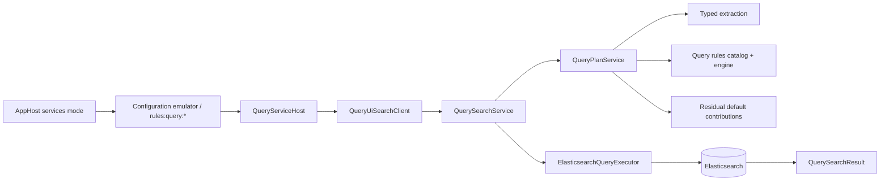

# Query walkthrough

Use this page after reading [Query pipeline](Query-Pipeline) when you want a code-oriented tour of how one search request moves from local AppHost startup conditions through planning and into Elasticsearch execution.

## Reading path

- Start with [Query pipeline](Query-Pipeline) for the conceptual overview and staged runtime map.
- Keep [Query signal extraction rules](Query-Signal-Extraction-Rules) and [Appendix: query rule syntax quick reference](Appendix-Query-Rule-Syntax-Quick-Reference) nearby when the walkthrough reaches rule evaluation and residual consumption.
- Continue to [Query model and Elasticsearch mapping](Query-Model-and-Elasticsearch-Mapping) when you want the field-by-field and clause-by-clause explanation of the final request body.
- Refer back to [Architecture walkthrough](Architecture-Walkthrough), [Solution architecture](Solution-Architecture), and [Project setup](Project-Setup) when you need wider repository or local-environment context.

## One-query mental model

The easiest way to understand the query runtime is to follow one representative search from AppHost services mode through the host, the planner, and the execution adapter.



Read the diagram from left to right. The important thing to notice is that AppHost does not merely start a UI. It also makes the configuration-backed query rules visible. `QueryServiceHost` then acts as the composition root for the read-side runtime, but the real query meaning is shaped inward by repository-owned services and infrastructure rather than by host-local UI code.

## 1. AppHost services mode makes query rules visible

In normal local development, `src/Hosts/AppHost/AppHost.cs` starts the retained service set in `runmode=services`.

For query work, three details matter together.

First, AppHost starts `QueryServiceHost` alongside `IngestionServiceHost` and the other retained local tools. That matters because query debugging usually depends on the same local Elasticsearch instance and the same configuration emulator that the rest of the stack is using.

Second, AppHost computes `rulesPath` from the repository root `rules` directory and passes that directory into `AddConfigurationEmulator` with `additionalConfigurationPrefix: "rules"`. The AppHost test `RuleConfigurationSeederPathTests` pins that behavior deliberately so the local services-mode workflow keeps discovering rule files from the top-level repository rules tree.

Third, because the configuration emulator walks the directory tree recursively, the physical repository path `rules/query/<rule-id>.json` becomes the logical configuration key `rules:query:<rule-id>`. That is the bridge between file authoring and runtime loading. When a contributor edits a query rule locally, they are still editing a file in the repository, but the running query host reads the effective rule set from configuration.

## 2. `QueryServiceHost` is the query composition root

`src/Hosts/QueryServiceHost/Program.cs` is the executable composition root for the query side.

The host is intentionally thin, but it is still the right first code stop because it wires together all four layers of the Onion Architecture for the query path.

### What the host does

The host currently does five practical things:

1. creates the web application builder and attaches shared service defaults
2. loads shared configuration and the Elasticsearch client reference
3. calls `AddQueryServices()` to register the repository-owned query runtime
4. configures the interactive Blazor Server UI and Keycloak-backed browser authentication
5. maps the interactive Razor components that render the protected query shell

This is the right separation of responsibilities for the current repository architecture. The host owns startup, authentication, UI composition, and dependency wiring. It does not own normalization, query rules, typed extraction, or Elasticsearch JSON generation.

### The main projects involved

When you trace a query, you will move across four main project areas:

- `src/Hosts/QueryServiceHost` for the interactive Blazor host, authentication, and UI adapter
- `src/UKHO.Search.Query` for the inward query contracts such as `QueryPlan`, `QueryInputSnapshot`, `QueryExtractedSignals`, `CanonicalQueryModel`, execution directives, diagnostics, and result shapes
- `src/UKHO.Search.Services.Query` for normalization, planning orchestration, rule evaluation, residual-default construction, and application-service coordination
- `src/UKHO.Search.Infrastructure.Query` for Microsoft Recognizers-backed typed extraction, App Configuration-backed rules loading and refresh, Elasticsearch mapping, and query execution

That project split is important because it tells contributors where a change belongs. If a search behavior question is really about what a query means, it usually belongs in the query contracts or service layer. If the question is how the plan is loaded from configuration or translated into Elasticsearch JSON, it usually belongs in infrastructure.

### What the current host shell now shows contributors

The current `QueryServiceHost` home page is no longer best understood as a simple search-results screen. It is now a single-screen developer workspace built to keep the most useful read-side artifacts visible at the same time.

At the top, `SearchBar.razor` remains the raw-query entry point, but it now stays visually terse because the surrounding shell already explains the workspace structure. In the middle of the page, `Home.razor` keeps two centre panes visible together: `QueryPlanPanel.razor` on the left and `ResultsPanel.razor` on the right. That centre split matters because it shortens the most common developer feedback loop. A contributor can submit raw text, immediately inspect the generated repository-owned plan in Monaco, and compare it with the projected result rows without switching tabs or moving to a second page.

Around that centre loop, the host keeps supporting context in flatter shell regions instead of piling more nested cards into the same area. `QueryInsightPanel.razor` is the left-column explanation surface for extracted signals and the compact transformation trace derived from the current `QueryPlan`. `QueryDiagnosticsPanel.razor` is the right-column diagnostics surface for the final Elasticsearch request JSON, validation output, warnings, and execution timings. `ResultExplainDrawer.razor` now serves two related roles. In the main workspace it acts as the lightweight selected-result summary and launch point for deeper inspection. Once opened, the same component becomes a full-screen opaque detail surface with a `Back` action that returns the contributor to the exact query workspace state they left.

One implementation detail is worth calling out because it changes how contributors should reason about the UI. The Monaco editor is not a second source of query truth. `QueryUiState` now keeps two host-local strings: the latest generated-plan baseline returned by the raw-query path and the writable editor text shown in Monaco. The editor is hosted by `JsonEditor.razor`, which imports `wwwroot/js/monacoEditorInterop.js` through Blazor JS module loading after `App.razor` loads `require.js`. That arrangement makes the plan visible and editable in the host, but the host is still only displaying a projection of the inward `QueryPlan` contract produced by the repository-owned query services.

The newest vertical slices add an important second half to that story. `QueryPlanPanel.razor` now places a pane-level `Search` button and a `Reset` action directly above Monaco. When a contributor presses `Search`, the host does not silently fall back to the raw-query bar. Instead, `QueryUiState` validates the Monaco contents as JSON, deserializes them into the repository-owned `QueryPlan` contract, projects any blocking validation failures into `QueryDiagnosticsPanel.razor`, and only then calls the supplied-plan execution route. The `Reset` action is the return path for edited Monaco text: it restores the editor text to the last raw-query-generated baseline without discarding the underlying runtime separation between host and application-service layers. In parallel, the selected-result explanation workflow now has its own explicit return path. Choosing a result opens the explanation in a dedicated full-screen mode, and pressing `Back` restores the main workspace without clearing the current query text, plan projection, diagnostics, or selected hit.

## 3. `AddQueryServices()` wires the runtime in dependency order

The host-local call to `AddQueryServices()` in `UKHO.Search.Infrastructure.Query.Injection` is where the query runtime becomes a concrete graph.

The registration order is revealing.

### Normalization and typed extraction come first

The extension registers:

- `IQueryTextNormalizer` -> `QueryTextNormalizer`
- `ITypedQuerySignalExtractor` -> `MicrosoftRecognizersTypedQuerySignalExtractor`

That tells you the planner will always begin from a repository-owned normalized snapshot and that Microsoft Recognizers is kept behind the inward `ITypedQuerySignalExtractor` abstraction rather than exposed directly to the rest of the runtime.

### Rule loading is configuration-backed and refresh-aware

The same composition root registers:

- `IQueryRulesSource` -> `AppConfigQueryRulesSource`
- `QueryRulesValidator`
- `QueryRulesLoader`
- `QueryRulesCatalog`
- `IQueryRulesCatalog` -> the same catalog singleton
- `AppConfigQueryRulesRefreshService` as a hosted service
- `IQueryRuleEngine` -> `ConfigurationQueryRuleEngine`

Two details matter here.

First, `QueryRulesCatalog` calls `EnsureLoaded()` during singleton creation. That means invalid query-rule JSON or unsupported rule contracts fail the host fast during composition rather than producing delayed runtime surprises after the first user query.

Second, the refresh service means the host is not stuck with a forever-static rule snapshot. Local or App Configuration-backed changes can produce later reloads without rebuilding the whole service graph.

### Planning and execution complete the chain

After the rule infrastructure is registered, the composition root adds:

- `IQueryPlanService` -> `QueryPlanService`
- `IQuerySearchService` -> `QuerySearchService`
- `IQueryPlanExecutor` -> `ElasticsearchQueryExecutor`

This is the code version of the runtime story already described conceptually on [Query pipeline](Query-Pipeline): the host delegates into an application service, the application service delegates into a planner and an executor, and the executor is the only layer that actually talks to Elasticsearch.

## 4. The host adapter keeps the UI thin

Inside `QueryServiceHost`, the practical bridge from the Blazor UI to the inward query runtime is `QueryUiSearchClient`.

That adapter matters because it keeps host-local request models and UI state out of the planner. The adapter receives a `QueryRequest`, logs the current limitation around unhandled facet selections, and delegates the raw query text into `IQuerySearchService`. The result then comes back as repository-owned hit data and a repository-owned `QueryPlan` that the adapter projects into the host-local response model. In current host behavior, the projected response now includes the retained `QueryPlan`, formatted generated-plan JSON for Monaco, formatted final Elasticsearch request JSON for the diagnostics column, search-engine timing when Elasticsearch reported one, and any non-blocking warnings surfaced by the inward pipeline.

This is one of the most important boundaries on the query side. If a contributor finds themselves wanting to build Elasticsearch clauses in a Razor component, the existence of `QueryUiSearchClient` and `IQuerySearchService` is the reminder that such logic belongs inward instead.

## 5. `QuerySearchService` coordinates planning and execution

`QuerySearchService` is the application-service boundary that joins planning and execution into one host-friendly call.

Its job is intentionally small:

1. call `IQueryPlanService.PlanAsync()`
2. call `IQueryPlanExecutor.SearchAsync()` with the resulting `QueryPlan`
3. log the total and duration
4. return a repository-owned `QuerySearchResult`

That small shape is useful. It means a contributor can usually ask a clean question while debugging: is the unexpected behavior already visible in the `QueryPlan`, or does it only appear after mapping and execution?

That same orchestration layer now also exposes a direct supplied-plan route. `ExecutePlanAsync()` accepts a caller-supplied `QueryPlan`, skips `IQueryPlanService`, and hands the plan straight to `IQueryPlanExecutor`. This is the critical point that keeps the Onion Architecture boundary intact while the UI becomes more developer-centric. The host can execute edited plans, but only by going through the same application-service boundary that raw-query execution already used.

## 6. Normalization creates the first stable runtime contract

`QueryPlanService` begins by normalizing the raw query text.

The normalizer currently does three core things:

- preserves the raw caller-supplied text
- lowercases the text into `NormalizedText`
- collapses repeated whitespace into `CleanedText` and tokenizes that cleaned form

The result is a `QueryInputSnapshot` with:

- `RawText`
- `NormalizedText`
- `CleanedText`
- `Tokens`
- `ResidualTokens`
- `ResidualText`

In the current implementation, the initial residual surfaces are just the full cleaned text and token stream. That means nothing has been consumed yet. Typed extraction can observe the normalized input, and the rule engine can later decide which parts of it should remain available for residual defaults.

This stage is often the first debugging stop because a surprising rule result can be caused by a surprisingly normalized input surface rather than by the rule itself.

## 7. Typed extraction runs before rules and fails soft

After normalization, `QueryPlanService` invokes `ExtractSignalsSafelyAsync()`, which calls `ITypedQuerySignalExtractor`.

The current infrastructure implementation is `MicrosoftRecognizersTypedQuerySignalExtractor`. It runs Microsoft Recognizers over the cleaned query text and normalizes the third-party results into repository-owned contracts:

- `QueryTemporalSignals.Years` for explicit four-digit years
- `QueryTemporalSignals.Dates` for richer temporal matches that are not simple year values
- `QueryNumericSignal` entries for recognized numeric fragments

The planner then uses those extracted signals to seed the initial canonical model before rules run. In current behavior, recognized years are projected straight into `CanonicalQueryModel.MajorVersion`.

Two runtime characteristics are important here.

First, typed extraction runs before rules so rules can react to already-recognized structured values rather than trying to rediscover them from raw text.

Second, extraction failure is soft rather than fatal. If recognizer invocation fails, the planner logs the error and continues with an empty extracted-signal contract. That means the query path still produces a deterministic default-only plan instead of collapsing the whole host request.

## 8. Rule evaluation shapes the plan and the residual surface

Once the seed model exists, `QueryPlanService` passes the normalized input, the extracted signals, and the seed model into `ConfigurationQueryRuleEngine`.

This is the stage where global query interpretation rules are actually applied.

### How the engine works in one pass

The engine currently:

1. reads a stable validated snapshot from `IQueryRulesCatalog`
2. copies the residual token stream into a mutable list
3. iterates the validated rules in deterministic order
4. evaluates each rule predicate against the normalized input and extracted signals
5. applies any model mutations, concepts, sort hints, filters, boosts, and consume directives for matches
6. records matched rule ids and applied execution diagnostics
7. rebuilds the residual text from the surviving residual token list

The stable-snapshot detail matters. One planning request always sees one coherent rule set even if configuration refresh occurs while later requests are being processed.

### How consumption changes the later plan

The residual token list starts as the full cleaned token stream. `consume` directives then modify that list in place.

The engine removes phrases first and tokens second. That ordering prevents a phrase such as `most recent` from being broken up before phrase matching has had a chance to remove it. Once the engine finishes, the remaining residual token list becomes the input for the planner’s default contributions.

This is the bridge between the query rules chapter and the later mapping stage. If the rule engine consumed the decisive parts of the query, the default layer becomes small or empty. If it left meaningful text behind, residual defaults still contribute broad matching behavior.

## 9. The planner builds residual defaults after rules finish

After rule evaluation returns, `QueryPlanService` creates default contributions from the final residual text and residual tokens.

The current behavior is intentionally small and deterministic:

- if residual tokens remain, create an exact-terms contribution against `keywords` with boost `1.0`
- if residual text remains, create analyzed-text contributions against `searchText` with boost `2.0` and `content` with boost `1.0`

This is the point where the runtime deliberately separates interpretation from fallback search. The rule engine had first chance to capture known concepts and execution intent. Only the text that survived that process reaches the default contribution layer.

## 10. One representative query through the full planning path

`latest SOLAS` remains the most useful representative example because each stage contributes something visible.

### Start with the host and normalizer

The Blazor UI sends the query into `QueryUiSearchClient`, which forwards the raw text `latest SOLAS` into `QuerySearchService`. The planner normalizes it into the cleaned text `latest solas` with residual tokens `latest` and `solas`.

### Typed extraction observes the query

For this particular query, typed extraction does not need to add any year-based canonical intent. That is still useful to notice because it means the example shows a rules-dominant path rather than a typed-extraction-dominant one.

### Rules shape the meaning

The representative rule behavior already documented elsewhere in the chapter set then applies:

- `concept-solas` recognizes `solas`, adds canonical keyword intent, emits a concept signal, and consumes the token `solas`
- `sort-latest` recognizes `latest`, emits a sort hint and execution sorts on `majorVersion` and `minorVersion`, and consumes the phrase `latest`

### Defaults become empty

Because both meaningful tokens have been consumed, the residual token stream becomes empty and no residual default contributions are created.

### The final plan is rule-shaped

The resulting `QueryPlan` is therefore shaped mainly by canonical keyword intent and execution sorts rather than by residual text matching. That is the exact outcome contributors should expect for a query whose most important semantics were already made explicit by rules.

## 11. The executor maps the plan and calls Elasticsearch

Once `QuerySearchService` has a `QueryPlan`, it delegates to `ElasticsearchQueryExecutor`.

The executor performs three steps that are worth tracing separately.

### It decides whether the plan is executable

Before issuing any request, the executor checks whether the plan contains executable clauses. If it contains neither canonical intent nor residual defaults nor execution directives that imply a meaningful query, the executor returns an empty result immediately rather than issuing a broad accidental search.

### It builds deterministic request JSON

If the plan is executable, the executor calls `ElasticsearchQueryMapper.CreateRequestBody(plan)`.

The mapper builds raw JSON directly and follows the same stable order every time:

1. `filter` clauses from execution filters
2. `should` clauses from canonical model contributions
3. `should` clauses from explicit boosts
4. `should` clauses from residual defaults
5. `minimum_should_match: 1`
6. optional `sort` clauses from execution sorts

That stable order is one of the main reasons the query chapter treats the repository-owned plan as the key contract. Once you understand the plan, the generated Elasticsearch request body becomes explainable rather than mysterious.

### It executes against the canonical index and parses the result

The executor posts the raw JSON to `/{indexName}/_search` using the configured Elasticsearch transport. It then parses the response into `QuerySearchResult` and `QuerySearchHit` rather than exposing raw Elasticsearch client types to the host.

The current result mapping keeps:

- the full executed `QueryPlan`
- the exact Elasticsearch request JSON that the executor generated
- the total hit count
- the measured wall-clock duration
- the search-engine-reported duration when Elasticsearch returns `took`
- any non-blocking warnings that explain skipped or limited execution
- a set of query hits with title, best available type-like value, region, matched field names, and an optional raw payload copy

That means the host UI can remain presentation-oriented while the infrastructure layer stays responsible for the search engine response shape. The host can now show contributors both the plan and the final request body side by side, but it still receives those artifacts as inward projections rather than recreating them in Razor code.

## Practical tracing recipes

### Trace one local query end to end

1. Start the local services stack:

   ```powershell
   dotnet run --project src/Hosts/AppHost/AppHost.csproj
   ```

2. Open the Query host endpoint from the Aspire dashboard.
3. Run a representative query such as `latest SOLAS`.
4. Watch `QueryServiceHost` logs for normalization, typed extraction, planning, and execution messages.
5. Use Kibana to inspect the indexed canonical documents that the query runtime is targeting.

The most useful mental model here is to separate the question into stages. Ask what the normalizer saw, what typed extraction recognized, which rules matched, what residual text survived, and only then what JSON reached Elasticsearch.

### Trace a rules-backed query

1. Edit the relevant JSON under `rules/query/*.json`.
2. Restart the services-mode stack or let the configuration refresh path reload the catalog.
3. Run a representative query such as `latest SOLAS`, `latest SOLAS msi`, or `latest notice`.
4. Check the planning logs for matched rule ids and applied execution diagnostics.
5. If the final search still looks wrong, compare the rule-shaped intent with the actual indexed canonical fields in Kibana.

This staged comparison is important because a wrong result can come from either side of the boundary. Sometimes the plan is correct and the indexed data is not. Sometimes the indexed data is correct and the plan is not. The walkthrough helps you separate those cases.

### Trace an edited-plan execution

1. Run a raw query first so Monaco receives the generated-plan baseline.
2. Edit one small part of the plan in the Monaco pane, such as a keyword list, a filter value, or a sort directive.
3. Click the pane-level `Search` button above Monaco.
4. If the diagnostics area shows validation errors, correct the JSON in place and rerun the pane-level search.
5. Compare the refreshed result set with the previous raw-query run, then click `Reset to generated plan` when you want to return to the last raw-query baseline.

This recipe is useful because it separates two kinds of debugging that used to blur together. Sometimes the question is whether the planner produced the right plan from raw text. Sometimes the question is what Elasticsearch would do if one part of an already-understood plan changed. The new edited-plan path is designed for the second question.

### Trace a year-bearing query

1. Run a query such as `latest notice from 2024`.
2. Check the typed-extraction logs for recognized years.
3. Confirm that the planner seeded `majorVersion` intent before rules ran.
4. Check which rules matched and whether any rule consumed the year text or only the recency and notice terms.
5. Inspect the final request body shape when the same year appears both as canonical intent and residual default text.

This recipe is useful because it reveals a current-state behavior that is easy to miss: typed extraction projects year intent into the canonical model, but it does not automatically consume the original year token from the residual path.

## Where to look when extending the query runtime

| Change you want to make | Start reading here | Then continue to |
|---|---|---|
| Query interpretation semantics or residual-default behavior | [Query pipeline](Query-Pipeline) | [Query signal extraction rules](Query-Signal-Extraction-Rules) -> [Query model and Elasticsearch mapping](Query-Model-and-Elasticsearch-Mapping) |
| Host composition or UI adapter behavior | `src/Hosts/QueryServiceHost` | [Architecture walkthrough](Architecture-Walkthrough) |
| Planning flow, normalization, or diagnostics | `src/UKHO.Search.Services.Query` | [Query model and Elasticsearch mapping](Query-Model-and-Elasticsearch-Mapping) |
| Rules loading, refresh, typed extraction, or Elasticsearch execution | `src/UKHO.Search.Infrastructure.Query` | [Query signal extraction rules](Query-Signal-Extraction-Rules) |

## Related pages

- [Query pipeline](Query-Pipeline)
- [Query signal extraction rules](Query-Signal-Extraction-Rules)
- [Query model and Elasticsearch mapping](Query-Model-and-Elasticsearch-Mapping)
- [Appendix: query rule syntax quick reference](Appendix-Query-Rule-Syntax-Quick-Reference)
- [Architecture walkthrough](Architecture-Walkthrough)
- [Project setup](Project-Setup)
- [Setup walkthrough](Setup-Walkthrough)
