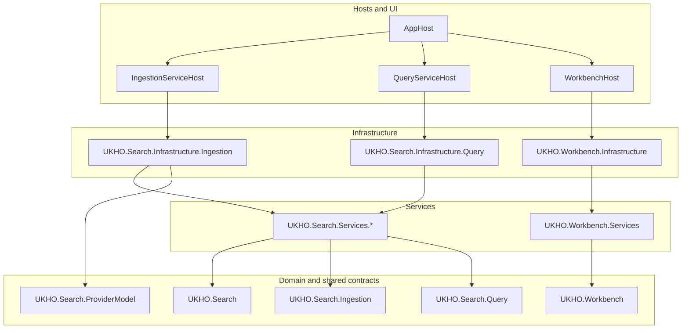
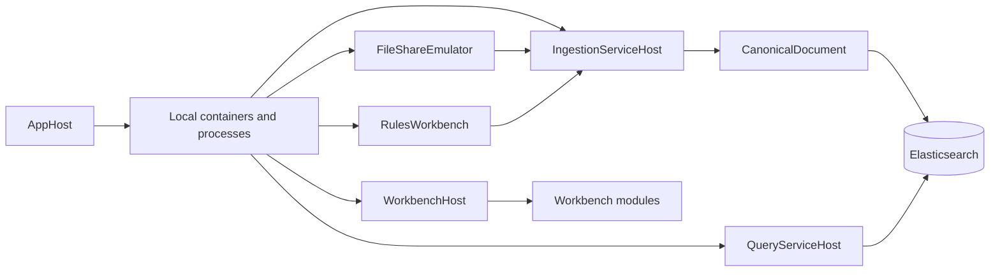

# Solution architecture

This page explains the current repository shape in narrative form. Read it after the [Glossary](Glossary) if the repository terms are unfamiliar, then continue to the [Architecture walkthrough](Architecture-Walkthrough) when you want a more code-oriented trace through the main runtime flows.

`UKHO.Search` follows **Onion Architecture**. The normal dependency direction is:

`Hosts / UI -> Infrastructure -> Services -> Domain`

That rule explains most of the structure in the repository: the inward layers define contracts and behaviour, while the outer layers wire external systems, runtime composition, and user-facing entry points around them.

The important part of that statement is not only the direction of dependencies. It is the design intent behind the dependency rule. The repository is trying to keep long-lived search concepts stable even when local tooling, provider behavior, runtime hosts, or external systems change around them. That is why host projects stay responsible for startup and composition, infrastructure projects stay responsible for adapters and operational concerns, and the inner projects hold the concepts that the rest of the solution keeps returning to.

## Why the repository is shaped this way

The repository solves a problem that would become fragile very quickly if every source-specific concern leaked across the whole solution. File Share ingestion has its own payloads, download behavior, rules, and enrichment steps. Local development has its own orchestration needs, seeded data flow, and authentication surface. Query has its own read-focused concerns. Workbench adds a shell and module model for developer tools. If those concerns were allowed to mix freely, every contributor would have to understand every external shape and every startup detail before making even a small change.

The current architecture is intended to prevent that sprawl. The inner layers define the shared runtime vocabulary and the shared search contract. The outer layers then adapt concrete systems and workflows onto that shared core. This keeps provider-specific parsing and enrichment at the edge, keeps indexing and query aligned on one canonical document shape, and keeps local developer tooling visible as part of the architecture rather than as undocumented side utilities.

That last point matters more than it first appears. In this repository, AppHost, File Share support tools, RulesWorkbench, and the Blazor-based Workbench shell are part of the normal engineering path. They are not disposable bootstrap helpers. They are the way contributors see the runtime, seed local data, inspect indexing behavior, author rules, and exercise module-based tooling. A useful architecture guide therefore has to explain those runtime surfaces as first-class architecture decisions, not as optional appendices.

## Start with these architecture ideas

Three ideas explain most of what you will see in the codebase:

1. **Provider-aware ingestion** keeps source-specific parsing and enrichment out at the provider boundary while producing one shared search model.
2. **Canonical indexing** gives the query side one stable discovery contract instead of making every consumer understand every source payload shape.
3. **Tool-assisted development** treats local tooling, AppHost orchestration, and Workbench composition as part of the normal engineering workflow.

Those ideas are tightly connected. Provider-aware ingestion would be hard to operate if the canonical model were vague. Canonical indexing would be harder to trust if the local tooling did not let contributors inspect the seeded data, queue activity, rules, and indexed results. Tool-assisted development would be much less useful if the underlying layering rules were weak enough that every tool had to reach directly into source-specific or host-specific implementation details. The repository shape is therefore not a set of separate conventions. It is one coordinated attempt to make ingestion, query, and tooling understandable without flattening them into one large undifferentiated application.

## Solution composition

## How to read the repository

If you are new to the solution, read the repository from outside inward.

Start with the hosts because they tell you which executable surfaces are actually active in day-to-day work. Then move inward to the infrastructure and service layers to understand how those hosts talk to queues, storage, Elasticsearch, Keycloak, and module discovery. Only after that should you settle into the inner contracts, runtime primitives, and canonical models that the outer layers are composing. This order matters because it keeps architecture reading grounded in the current runtime instead of in an abstract project list.

### Hosts and UI own runtime composition

The host projects are the outer entry points.

They matter architecturally because they express the current runtime story in executable form. `AppHost` tells you which local services and tools belong to the expected developer environment. `IngestionServiceHost` tells you how the pipeline is composed for real work rather than for isolated unit tests. `QueryServiceHost` tells you where the canonical index is read. `WorkbenchHost` tells you how the desktop-like Blazor shell becomes the runtime container for module-driven tooling. When a contributor wants to understand what the repository is really doing today, these hosts are the most honest starting point.

`QueryServiceHost` is especially important after the query bootstrap slice. The host is no longer backed by a deterministic stub search client. It now fronts a real inward query pipeline: the host-local UI adapter forwards the user's text into `UKHO.Search.Services.Query`, the planner normalizes and tokenizes the input into a repository-owned `QueryPlan`, the infrastructure-backed typed extractor runs Microsoft Recognizers behind `ITypedQuerySignalExtractor`, recognized years are projected into the canonical `majorVersion` intent before rules execute, the flat query-rule catalog loads `rules/query/*.json` through the `rules:query:*` configuration namespace, and `UKHO.Search.Infrastructure.Query` translates the resulting plan into Elasticsearch JSON that targets the canonical fields `keywords`, `searchText`, and `content`. That additional rule stage matters because it introduces a new contributor-facing concept: a query rule is now a global search interpretation rule rather than an ingestion enrichment rule. A query rule consumes normalized input and typed signals, can add canonical keywords, can emit explicit execution-time filters that constrain results without affecting score, can emit explicit boost clauses that add extra scoring weight to selected fields or values, can emit sort hints, and can consume phrases such as `latest` so defaults do not blindly search for them again. The distinction matters because it explains where future query semantics should live. Host code still owns composition and UI concerns, but typed extraction, planning rules, canonical query contracts, and Elasticsearch mapping now live in the same inward layers that the rest of the repository can evolve and test. This page stays at the subsystem-boundary level. Continue to [Query pipeline](Query-Pipeline) for the narrative entry point and then to [Query walkthrough](Query-Walkthrough) when you need the dedicated query-side chapter rather than the short architecture summary.

| Area | Key paths | Responsibility |
|---|---|---|
| Aspire orchestration | `src/Hosts/AppHost` | Starts and coordinates the local environment, including service containers, tool processes, and run-mode switching. |
| Ingestion runtime host | `src/Hosts/IngestionServiceHost` | Wires queue polling, provider registration, enrichment, Elasticsearch indexing, and dead-letter handling into one executable host. |
| Query runtime host | `src/Hosts/QueryServiceHost` | Exposes the query-side runtime that accepts UI input, hands it to the repository-owned planner, and reads the indexed canonical form through Elasticsearch-backed execution. |
| Workbench UI host | `src/workbench/server/WorkbenchHost` | Runs the desktop-like Blazor Server shell and hosts module-driven tools. |

### Domain and contracts stay inward

The inner projects define the repository's reusable runtime and model concepts.

These projects are where the repository tries to stay stable as outer implementation details move. The graph runtime, ingestion contracts, canonical model, provider metadata, and Workbench contracts form the vocabulary that the rest of the solution keeps reusing. If an idea belongs in these inner layers, it usually means the repository expects that idea to survive provider changes, host reshaping, or tooling evolution. If an idea only matters because one concrete adapter or runtime process needs it, it normally belongs farther out.

| Area | Key paths | Responsibility |
|---|---|---|
| Pipeline runtime | `src/UKHO.Search` | Defines channels, envelopes, nodes, supervision, metrics, and other primitives used by ingestion. |
| Canonical ingestion model | `src/UKHO.Search.Ingestion` | Defines ingestion contracts, provider abstractions, and the shared `CanonicalDocument` discovery shape. |
| Query model | `src/UKHO.Search.Query` | Holds the query-side canonical model, query-plan contracts, typed extracted-signal contracts, query-rule contracts, diagnostics contracts, and search-result contracts that sit on the canonical index. |
| Provider metadata | `src/UKHO.Search.ProviderModel` | Shares provider identity, metadata, and split registration helpers across hosts and tooling. |
| Workbench contracts | `src/workbench/server/UKHO.Workbench` | Defines shell contracts, models, and module registration boundaries for Workbench. |

### Services and infrastructure translate between the edges and the core

The service and infrastructure layers bridge external systems, runtime policies, and domain contracts.

This bridge role is important because it stops two unhelpful extremes. It stops the hosts from becoming giant composition-plus-business-logic applications, and it stops the inner layers from growing direct knowledge of queues, blob storage, Elasticsearch, OpenID Connect, module probing, or other operational mechanics. Contributors will often find the real answer to a design question here, because this is the place where repository policy meets concrete runtime integration.

| Area | Key paths | Responsibility |
|---|---|---|
| Search services | `src/UKHO.Search.Services.*` | Coordinate domain behaviours into host-friendly application flows. |
| Ingestion infrastructure | `src/UKHO.Search.Infrastructure.Ingestion` | Owns queue integration, Elasticsearch projection, dead-letter persistence, bootstrap, and rule runtime infrastructure. |
| Query infrastructure | `src/UKHO.Search.Infrastructure.Query` | Owns query-side infrastructure adapters, including Microsoft Recognizers-backed typed extraction, flat configuration-backed query-rule loading and refresh, Elasticsearch request mapping, and runtime execution of repository-owned query plans. |
| Workbench services | `src/workbench/server/UKHO.Workbench.Services` | Owns tool activation, command routing, contribution composition, and shell-facing orchestration. |
| Workbench infrastructure | `src/workbench/server/UKHO.Workbench.Infrastructure` | Owns `modules.json` reading, probe-root scanning, and bounded module loading. |

### Provider and tool projects sit at purposeful edges

These projects sit at the edge on purpose rather than by accident. The concrete File Share provider is allowed to know about File Share-specific request dispatch, enrichers, and parsing because that knowledge should not spread inward. The local tools are allowed to be strongly task-focused because their job is to make a specific engineering workflow visible and operable. Workbench modules are allowed to contribute bounded features because the shell keeps ownership of composition and layout. Thinking about these projects as purposeful edges helps prevent a common mistake: assuming that because something is operationally important, it therefore belongs in the inner shared model.

| Area | Key paths | Responsibility |
|---|---|---|
| Current concrete provider | `src/Providers/UKHO.Search.Ingestion.Providers.FileShare` | Owns File Share request dispatch, processing graph, enrichers, and source-specific parsing. |
| Local tools | `tools/FileShareEmulator`, `tools/FileShareImageLoader`, `tools/FileShareImageBuilder`, `tools/RulesWorkbench` | Support local data workflows, diagnostics, and rule authoring. |
| Workbench modules | `src/Workbench/modules/UKHO.Workbench.Modules.*` | Contribute tools into the shell through bounded module contracts. |

## High-level subsystem interactions

## Test estate in one view

The repository uses a project-aligned test layout under `test/`.

- most production projects have a matching `<ProductionProjectName>.Tests` project
- shared helper-only test infrastructure lives in `test/UKHO.Search.Tests.Common`
- intentionally cross-project verification lives in `test/UKHO.Search.IntegrationTests`
- canonical shared fixtures live in `test/sample-data`

This structure matters architecturally because it mirrors ownership boundaries: tests usually live with the production project they verify, while cross-project behaviour is pushed to the outer integration layer.

That mirroring is part of the architecture story rather than a separate test-only concern. The repository is trying to make ownership visible everywhere: in project references, in host composition, in provider boundaries, and in the way test projects line up with production projects. When you are deciding where a change belongs, the test layout often reinforces the same answer that the production layering already suggests.

## Common pitfalls when reading the architecture

- Do not start with one deep implementation file and assume it represents the whole solution. Start with the host, then trace inward.
- Do not treat `UKHO.Search.ProviderModel` as provider-specific implementation code. It is shared metadata and registration infrastructure.
- Do not treat Workbench modules as shell owners. The shell stays in `WorkbenchHost` and `UKHO.Workbench*`; modules contribute bounded tools and services.
- Do not assume query reads source payloads directly. Query reads the indexed canonical projection.
- Do not assume all retained repository code is part of the active local workflow. Follow the active hosts and tools linked from [Home](Home).

## Recommended next pages

- Continue to the [Architecture walkthrough](Architecture-Walkthrough) for code-oriented runtime flows.
- Follow the [Ingestion pipeline](Ingestion-Pipeline) path when you need the detailed processing graph and stage-by-stage runtime explanation.
- Follow the [Query pipeline](Query-Pipeline) path when you need the staged explanation of normalization, typed extraction, query rules, residual defaults, and Elasticsearch execution.
- Follow the current [Workbench introduction](Workbench-Introduction) guidance when you need shell composition, module loading, and tool activation detail.
- Return to the [Glossary](Glossary) if repository-specific terms become ambiguous while reading.
