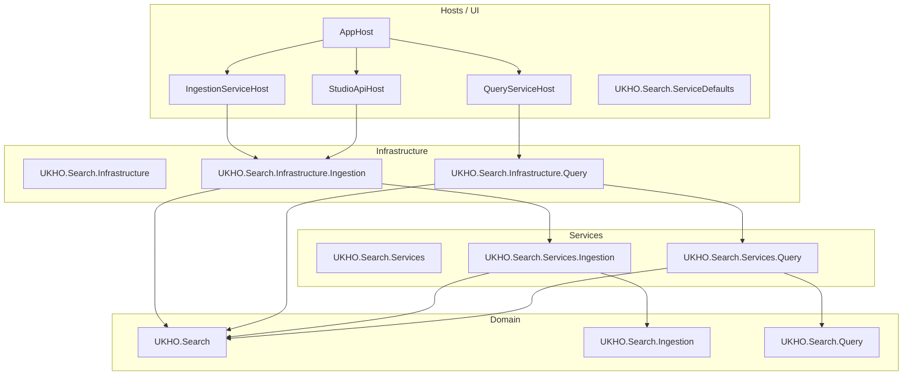
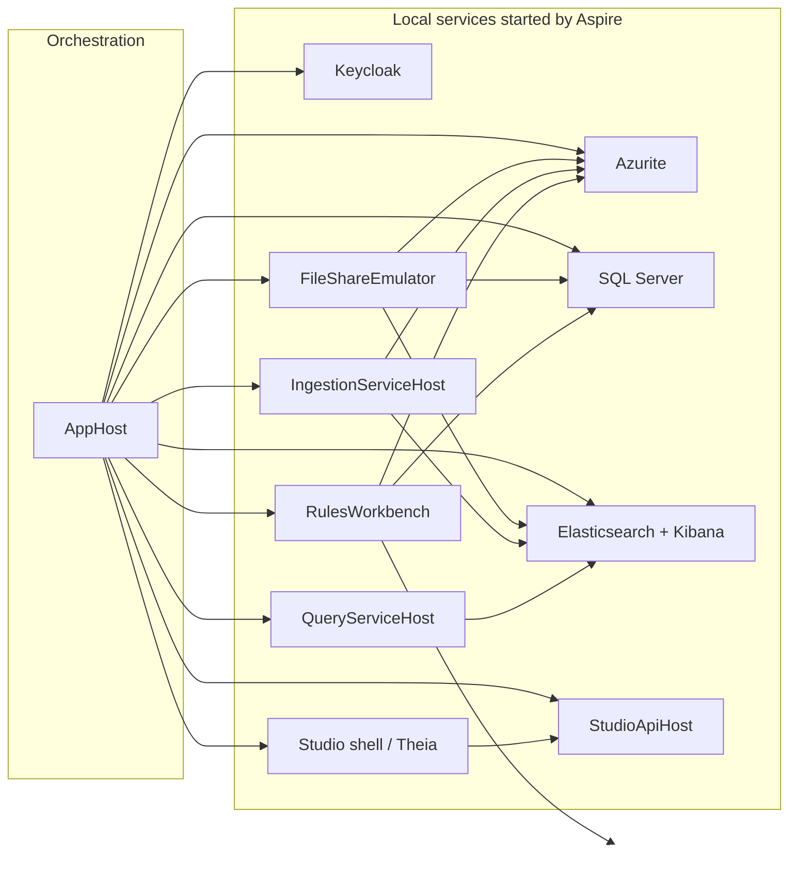

# Solution architecture

This repository follows **Onion Architecture**.

The dependency direction is:

`Hosts / UI -> Infrastructure -> Services -> Domain`

Tools and configuration projects sit alongside that main path, but the same intent applies: domain models and pipeline primitives stay inward; adapters and startup wiring stay outward.

## High-level structure

## Project map

### Hosts and UI

| Project | Purpose |
|---|---|
| `src/Hosts/AppHost` | Aspire orchestration, container/resource definitions, and run-mode switching for local workflows. |
| `src/Hosts/IngestionServiceHost` | Ingestion host, DI/bootstrap, Elasticsearch/blob/queue client wiring, operational UI. |
| `src/Hosts/QueryServiceHost` | Query-side host and external endpoint surface. |
| `src/Studio/StudioApiHost` | Studio-facing minimal API host for development-time tooling, including provider metadata discovery and read-only rules discovery. |
| `src/Hosts/UKHO.Search.ServiceDefaults` | Shared Aspire/OpenTelemetry/health-check defaults for hosts. |

### Shared provider and studio support

| Project | Purpose |
|---|---|
| `src/UKHO.Search.ProviderModel` | Shared provider descriptors, catalogs, and registration helpers used by ingestion and studio composition. |
| `src/Studio/UKHO.Search.Studio` | Studio provider contracts, catalogs, and registration validation for development-time tooling. |

### Domain

| Project | Purpose |
|---|---|
| `src/UKHO.Search` | Pipeline runtime primitives: envelopes, nodes, channels, supervision, retry, dead-letter, geo primitives, metrics. |
| `src/UKHO.Search.Ingestion` | Ingestion request contracts, canonical document model, provider abstractions, enrichment node. |
| `src/UKHO.Search.Query` | Query-side domain concerns such as token normalization. |

### Services

| Project | Purpose |
|---|---|
| `src/UKHO.Search.Services` | Shared service-layer orchestration concerns. |
| `src/UKHO.Search.Services.Ingestion` | Ingestion service orchestration and provider-level coordination. |
| `src/UKHO.Search.Services.Query` | Query service orchestration. |

### Infrastructure

| Project | Purpose |
|---|---|
| `src/UKHO.Search.Infrastructure` | Shared infrastructure utilities and adapters. |
| `src/UKHO.Search.Infrastructure.Ingestion` | Ingestion bootstrap, queue/blob/Elasticsearch integrations, rules-engine runtime infrastructure. |
| `src/UKHO.Search.Infrastructure.Query` | Query-side infrastructure adapters. |

### Provider project

| Project | Purpose |
|---|---|
| `src/Providers/UKHO.Search.Ingestion.Providers.FileShare` | The current concrete ingestion provider. Owns the File Share processing graph, request dispatch, ZIP/content enrichers, and provider-specific parsing. |
| `src/Providers/UKHO.Search.Studio.Providers.FileShare` | Tandem File Share Studio provider registration used for development-time provider discovery/composition without ingestion runtime services. |

### Configuration projects

| Project | Purpose |
|---|---|
| `configuration/UKHO.Aspire.Configuration` | Shared configuration support. |
| `configuration/UKHO.Aspire.Configuration.Hosting` | Aspire-side configuration integration. |
| `configuration/UKHO.Aspire.Configuration.Seeder` | Configuration seeding support. |
| `configuration/UKHO.Aspire.Configuration.Emulator` | Local emulator configuration behavior. |

### Developer tools

| Project | Purpose |
|---|---|
| `tools/FileShareEmulator` | Local File Share emulator UI/API. |
| `tools/FileShareEmulator.Common` | Shared emulator types/utilities. |
| `tools/FileShareImageLoader` | Imports a Docker data image into local SQL/blob storage. |
| `tools/FileShareImageBuilder` | Builds a Docker data image from a remote File Share environment. |
| `tools/RulesWorkbench` | Rule inspection, evaluation, batch scan, and rule-checker tooling. |

### Tests

The repository now uses a project-aligned test layout under `test/`.

General rule:

- each production project has a matching `<ProductionProjectName>.Tests` project
- broad helper-only test infrastructure lives in `test/UKHO.Search.Tests.Common`
- intentionally cross-project integration coverage lives in `test/UKHO.Search.IntegrationTests`
- canonical shared fixtures live in `test/sample-data`

Current aligned structure:

| Area | Matching test projects |
|---|---|
| Domain | `test/UKHO.Search.Tests`, `test/UKHO.Search.Ingestion.Tests`, `test/UKHO.Search.Query.Tests` |
| Services | `test/UKHO.Search.Services.Tests`, `test/UKHO.Search.Services.Ingestion.Tests`, `test/UKHO.Search.Services.Query.Tests` |
| Provider | `test/UKHO.Search.Ingestion.Providers.FileShare.Tests` |
| Infrastructure | `test/UKHO.Search.Infrastructure.Tests`, `test/UKHO.Search.Infrastructure.Ingestion.Tests`, `test/UKHO.Search.Infrastructure.Query.Tests` |
| Hosts / UI | `test/AppHost.Tests`, `test/IngestionServiceHost.Tests`, `test/QueryServiceHost.Tests`, `test/StudioApiHost.Tests`, `test/UKHO.Search.ServiceDefaults.Tests` |
| Tools | `test/FileShareEmulator.Tests`, `test/FileShareEmulator.Common.Tests`, `test/FileShareImageBuilder.Tests`, `test/FileShareImageLoader.Tests`, `test/RulesWorkbench.Tests` |
| Configuration | `test/UKHO.Aspire.Configuration.Tests`, `test/UKHO.Aspire.Configuration.Hosting.Tests`, `test/UKHO.Aspire.Configuration.Seeder.Tests`, `test/UKHO.Aspire.Configuration.Emulator.Tests` |
| Shared / integration exceptions | `test/UKHO.Search.Tests.Common`, `test/UKHO.Search.IntegrationTests` |

Some audited projects currently contain placeholder smoke tests so the matching test-project structure is explicit even before real project-specific tests are added.

Shared test-asset conventions:

- `test/sample-data` is the canonical shared fixture folder
- keep `test/sample-data` flat rather than introducing per-feature subfolders
- use `SampleDataFileLocator` from `test/UKHO.Search.Tests.Common` when tests need to resolve those shared assets from build output locations

## Runtime architecture

## Where major concerns live

### Ingestion runtime

- queue polling, Elasticsearch indexing, blob dead-letter persistence: `src/UKHO.Search.Infrastructure.Ingestion`
- node/channel runtime: `src/UKHO.Search`
- request contracts and `CanonicalDocument`: `src/UKHO.Search.Ingestion`
- File Share provider graph/enrichers: `src/Providers/UKHO.Search.Ingestion.Providers.FileShare`

### Query/runtime discovery model

- canonical search shape starts in `src/UKHO.Search.Ingestion`
- Elasticsearch projection lives in `src/UKHO.Search.Infrastructure.Ingestion/Elastic`
- query-side services/hosts consume the indexed form

### Local developer tooling

- emulator UI/API: `tools/FileShareEmulator`
- rule tooling: `tools/RulesWorkbench`
- studio shell/API: `src/Studio/Server`, `src/Studio/StudioApiHost`
- data-image import/export: `tools/FileShareImageLoader`, `tools/FileShareImageBuilder`

## Architectural intent

Three design choices explain most of the repository:

1. **Provider extensibility** — the ingestion host is designed to support multiple providers, even though File Share is the current concrete implementation.
2. **Canonical indexing** — source-specific payloads are normalized into a shared discovery contract before indexing.
3. **Tool-assisted local development** — the emulator, loader, builder, and RulesWorkbench reduce dependence on live environments.

For the provider and ingestion runtime details, continue to:

- [Ingestion pipeline](Ingestion-Pipeline)
- [Ingestion service provider mechanism](Ingestion-Service-Provider-Mechanism)
- [File Share provider](FileShare-Provider)
- [Tools: `RulesWorkbench`](Tools-RulesWorkbench)
