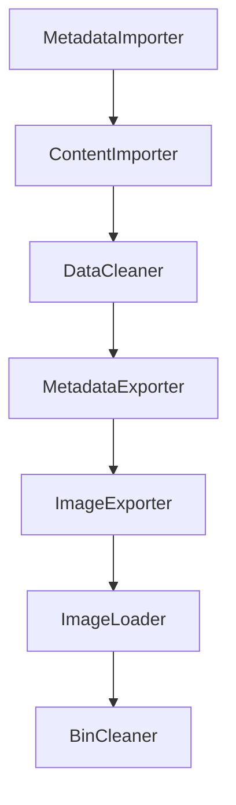

# Tools (advanced): `FileShareImageBuilder`

`FileShareImageBuilder` is the advanced developer tool used to create a new local Docker data image from a remote File Share environment.

Use it only when the shared image is missing, stale, or you need a custom export slice.

## What it produces

A Docker image named:

- `fss-data-<environment>`

And a tar export at:

- `<dataImagePath>\fss-data-<environment>.tar`

That image is later consumed by `AppHost` import mode and `FileShareImageLoader`.

## Why this tool exists

The local developer experience depends on a realistic File Share data set, but developers should not have to re-download or rebuild that data on every run.

`FileShareImageBuilder` creates a portable, reusable snapshot containing:

- exported metadata database content
- exported batch ZIP content
- image metadata suitable for later import

## How it is started

In this repository the intended entry point is Aspire `runmode=export`.

In export mode, `AppHost` adds `FileShareImageBuilder` as an **explicit-start** resource and passes:

- `environment`
- `ingestionmode`
- SQL connection information
- blob connection information

## Required local configuration

Create a local-only file alongside the built app output named:

- `configuration.override.json`

The README describes it as non-committed and environment-specific.

Required settings include:

- `sourceDatabase`
- `remoteService`
- `tenantId`
- `clientId`
- `dataImagePath`
- `dataImageBinSizeGB`
- `dataImageCount`

The tool also reads `environment` and `ingestionmode` from environment variables supplied by `AppHost`.

## Authentication model

The tool uses:

- `PublicClientApplicationBuilder`
- Microsoft Entra interactive authentication
- a best-effort persistent MSAL cache
- `FileShareReadOnlyClientFactory` to create a File Share client against `remoteService`

In practice, this means:

- you sign in interactively
- the tool calls the remote File Share read-only API
- the local export run pulls metadata/content into local working state before packaging it

## End-to-end export sequence

`ImageBuilder` orchestrates the workflow in this order:

### 1. `MetadataImporter`

Imports source metadata into the local working database.

### 2. `ContentImporter`

Downloads and stages batch content from the remote File Share service.

### 3. `DataCleaner`

Prunes the local metadata set according to the selected ingestion mode.

This is important because `ingestionmode` affects whether committed batches without downloaded ZIPs are removed.

- `Strict` prunes more aggressively
- `BestEffort` keeps committed batches even when ZIPs are missing, aligning with best-effort ingestion behavior

### 4. `MetadataExporter`

Exports the metadata database into the `.bacpac` that will later be consumed by `FileShareImageLoader`.

### 5. `ImageExporter`

Builds the final Docker image by writing a tiny Dockerfile and running:

- `docker build`
- `docker save`

The image contains the exported files under `/data`.

### 6. `ImageLoader`

Loads the new image into local Docker so it is immediately available for import mode.

### 7. `BinCleaner`

Cleans temporary export bins/workspace artifacts.

## Important sync rules

Keep these values aligned:

- AppHost `Parameters:environment`
- AppHost `Parameters:ingestionMode`
- `configuration.override.json` remote/export settings
- expected local image name `fss-data-<environment>`

If these drift, the wrong image may be built, loaded, or consumed.

## Pre-run hygiene

The README recommends starting from a clean local state:

- remove the local File Share emulator SQL database used for the export run
- clear relevant Azurite blob containers

This avoids mixing old seed data with the new export.

## Operational notes on `ImageExporter`

`ImageExporter` intentionally emits a simple Dockerfile:

- base image: `alpine`
- working directory: `/data`
- copy the exported bin contents into `/data`

It also prints heartbeat messages during long Docker operations so developers know the export is still running.

## Typical workflow

1. Prepare `configuration.override.json`.
2. Set `runmode=export`.
3. Start `AppHost`.
4. Explicitly start `FileShareBuilder` from the Aspire dashboard.
5. Wait for completion.
6. Confirm the image exists locally as `fss-data-<environment>`.
7. Switch to `runmode=import` and seed a local environment.

## When not to use it

Do not use `FileShareImageBuilder` for normal day-to-day development if the shared image already meets your needs. Pulling the shared image from ACR is simpler and faster.

## Related pages

- [Project setup](Project-Setup)
- [Tools: `FileShareImageLoader` and `FileShareEmulator`](Tools-FileShareImageLoader-and-FileShareEmulator)
