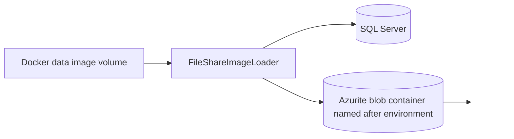
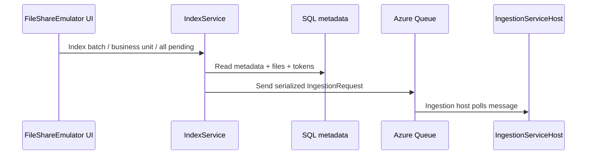

# Tools: `FileShareImageLoader` and `FileShareEmulator`

These two tools make the local File Share workflow usable without depending on a live environment.

- `FileShareImageLoader` seeds local SQL/blob state from a Docker data image.
- `FileShareEmulator` provides a Blazor UI and API over that local state so developers can inspect data and drive ingestion.

## `FileShareImageLoader`

### What it is

`tools/FileShareImageLoader` is a small ASP.NET Core-based import tool that runs inside a container in `runmode=import`.

Its job is to take the contents of a mounted data image and load them into the local dependencies used by the emulator:

- SQL Server metadata database
- Azurite blob storage

### What it does

At startup it:

1. reads the `environment` variable
2. connects to SQL Server and blob storage via Aspire-provided connection information
3. imports `/data/<environment>.bacpac` into the local emulator database
4. applies schema migration metadata for the imported image
5. imports blob content into the blob container named after `environment`

### Key operational details

- the tool expects `environment` to be present
- the import source is mounted at `/data`
- the tool prints a simple completion/failure message to stdout/stderr
- it is intended to be run explicitly from the Aspire dashboard

### What it is not

It is not a general-purpose ingestion tool. It prepares the emulator's backing stores; it does not queue ingestion messages or run the search pipeline.

## `FileShareEmulator`

### What it is

`tools/FileShareEmulator` is a Blazor Server app plus API surface that acts as the local stand-in for File Share behavior and developer operations.

It connects to:

- SQL Server metadata
- Azurite blobs and queues
- Elasticsearch

### Main features

#### 1. Statistics home page

The home page shows local metadata statistics such as:

- batch count
- file count
- batch/file attribute counts
- read-user and read-group counts
- local metadata/image markers

This is the fastest way to verify that import mode successfully loaded data.

#### 2. Indexing page

The indexing page is the main operational UI for driving the ingestion host.

Available actions include:

- **Index next pending batches** — submit the next `N` pending batches
- **Index all pending batches** — submit everything currently pending
- **Index batch by id** — queue a single batch for debugging
- **Index batch by business unit** — queue all pending batches for a selected business unit
- **Reset all batches to pending** — make all batches re-indexable
- **Clear ingestion queue** — drain the main queue and poison queue
- **Delete Elasticsearch indexes** — delete all indexes in the connected Elasticsearch instance

These capabilities are backed by services in `tools/FileShareEmulator/Services`.

#### 3. Batch file download API

The emulator exposes:

- `GET /batch/{batchId}/files`

That endpoint streams the ZIP for a batch directly from the seeded blob container.

This endpoint is important because provider-side ZIP download/enrichment depends on File Share-style access to batch content.

#### 4. OpenAPI / Scalar

The emulator publishes OpenAPI and a Scalar reference UI for the API surface, which is useful when testing the download endpoint directly.

## How the indexing workflow works

`IndexService` creates `IngestionRequest` payloads from local SQL metadata and sends them onto the queue:

- queue name: `file-share-queue`
- payload format: serialized `IngestionRequest`
- security tokens: derived using `BatchSecurityTokenService`

## Business unit indexing

A newer emulator capability allows selecting a business unit and submitting all currently pending batches for that unit.

This is useful when:

- rules or enrichers are scoped to business-unit-specific data sets
- you want a smaller test slice than "index all"
- you want repeatable targeted ingestion runs for debugging

## Queue management

`IngestionQueueService` supports:

- querying queue status
- draining the main queue and poison queue
- verifying stable emptiness across multiple polls

This is intentionally more defensive than a single "clear" call, because local queue state may still be in flux due to visibility timeouts or concurrent producers.

## Download behavior and blob lookup

Both the emulator API and the download service use a case-tolerant blob lookup strategy:

1. try normalized lower-case blob path first
2. try original casing
3. fall back to case-insensitive enumeration if needed

That reduces surprising 404s when seeded content casing differs from expectations.

## When to use each tool

### Use `FileShareImageLoader` when

- you have a Docker data image already
- you want to seed or refresh the local emulator backing stores
- you are starting a new local environment or refreshing from a known baseline

### Use `FileShareEmulator` when

- you want to verify imported data exists
- you want to submit batches into the ingestion queue
- you want to test targeted indexing scenarios
- you want to clear queues or reset local state
- you want to download the ZIP for a specific batch

## Typical local sequence

1. Import the image with `FileShareImageLoader`.
2. Switch to `services` mode.
3. Open `FileShareEmulator`.
4. Check statistics.
5. Queue a batch or business unit for ingestion.
6. Observe the ingestion host in Aspire.

## Related pages

- [Project setup](Project-Setup)
- [Setup walkthrough](Setup-Walkthrough)
- [Setup troubleshooting](Setup-Troubleshooting)
- [Tools (advanced): `FileShareImageBuilder`](Tools-Advanced-FileShareImageBuilder)
- [Ingestion pipeline](Ingestion-Pipeline)
- [File Share provider](FileShare-Provider)
