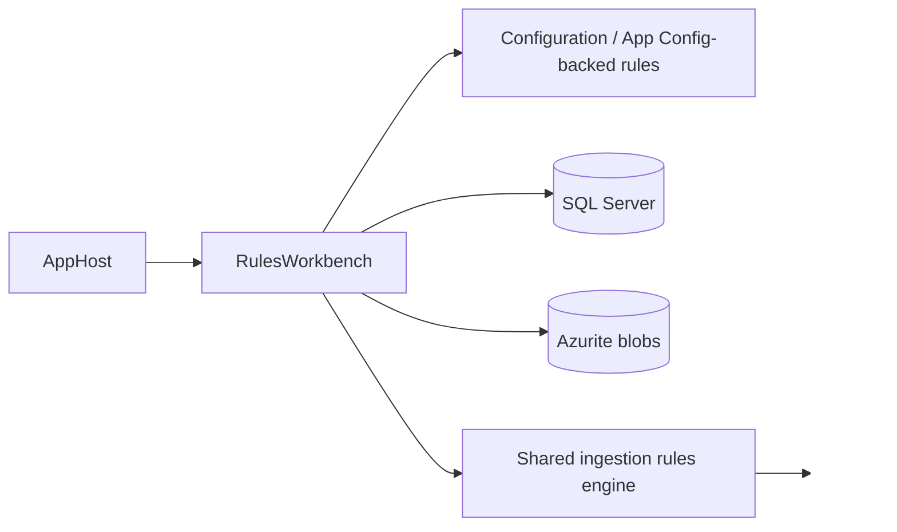
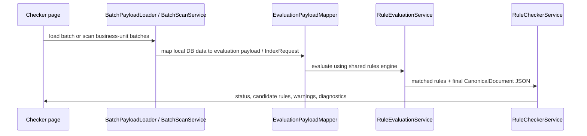

# Tools: `RulesWorkbench`

`RulesWorkbench` is the developer tool for inspecting and refining ingestion rules without running a full end-to-end ingestion cycle for every change.

This page documents only the parts of the tool that are currently stable enough to describe:

- the **Rules** page
- the **Checker** page

The **Evaluate** page is intentionally not documented here because it is expected to change.

## What `RulesWorkbench` is

`tools/RulesWorkbench` is a Blazor Server tool that sits alongside the local Aspire stack.

It is designed to help rule authors and ingestion developers:

- browse the active rule set
- edit rules safely
- validate rule JSON
- save valid rules back to Azure App Configuration
- run targeted checker workflows against real local batch data

It uses the same ingestion rules infrastructure as the runtime, so it is not just a disconnected sandbox UI.

## Where it fits in the local stack

`RulesWorkbench` is started by `AppHost` in `runmode=services` and sits next to:

- `IngestionServiceHost`
- `FileShareEmulator`
- `QueryServiceHost`
- SQL Server
- Azurite
- Elasticsearch

## Runtime dependencies

At startup `RulesWorkbench`:

- loads configuration using the same service-group configuration path as the hosts
- registers the ingestion rules engine
- registers SQL and blob clients
- forces the shared rule catalog to load during app startup

This matters because the tool is intended to stay close to runtime behavior, especially for rule parsing and application.

## Navigation scope of this page

`RulesWorkbench` currently has navigation entries for:

- `Home`
- `Rules`
- `Evaluate`
- `Checker`

This wiki page only covers:

- `Rules`
- `Checker`

## The `Rules` page

Route:

- `/rules`

Purpose:

- browse the currently loaded rules
- inspect the JSON for a selected rule
- edit a rule either directly as JSON or through a simple builder UI
- validate rule JSON before applying it
- save valid rules back to Azure App Configuration

### What the page loads

The page uses `AppConfigRulesSnapshotStore`.

That store:

- reads rules from configuration keys under the `rules:` prefix
- preserves provider/rule identity metadata
- keeps an editable in-memory view of the rules
- supports updating a selected rule's JSON after validation

In practice, the page is focused on the `file-share` provider rules loaded through the local configuration path.

### Main capabilities on the `Rules` page

#### 1. Search/filter

The page supports filtering by:

- rule id
- description text

The filter preserves ruleset order, which is important because rule order can matter operationally.

#### 2. Rule selection

When a rule is selected, the page shows:

- provider + rule id
- configuration key
- validation state
- description (when present)
- full JSON view

#### 3. Copy JSON

The selected rule JSON can be copied to the clipboard directly from the page.

#### 4. JSON editing mode

JSON mode allows direct editing of the rule JSON.

The page validates the JSON using `IRuleJsonValidator` and:

- shows whether the JSON is valid
- rejects rules that are missing a non-empty `title`
- blocks apply/save flows when invalid
- prevents switching into builder mode until the JSON is valid again

`title` is now treated as required authoring metadata. It should be concise display-oriented text that describes the matched rule outcome rather than an internal id.

#### 5. Builder mode

Builder mode is a guided editor over the underlying JSON.

Current builder support includes:

- basic `all` / `any` predicate composition
- simple property equality and existence conditions
- file MIME type equality conditions
- common `then` actions such as `keywords.add`, `searchText.add`, `content.add`, and taxonomy fields

The builder patches the JSON representation rather than using a separate rule model at runtime.

The builder also emits a required display `title`, so rules authored through the page remain valid under the runtime title contract.

#### 6. Save to Azure App Configuration

When a rule is valid, the page can save it through `IRuleConfigurationWriter`.

The current save flow:

1. writes the rule JSON to App Configuration key `rules:{provider}:{ruleId}`
2. updates the refresh sentinel (`auto.reload.sentinel`)

That means the `Rules` page is not just an editor; it is the current write path for valid rules.

### Important operational note

The `Rules` page is about authoring and maintaining rule definitions.
It is **not** the page to use when you want to understand why one particular batch did or did not satisfy a rule set. That is the role of the `Checker` page.

## The `Checker` page

Route:

- `/checker`

Purpose:

- run the rules path against real local batch data
- show what matched
- highlight candidate-but-unmatched rules
- explain why the resulting `CanonicalDocument` is acceptable or incomplete

The page is explicitly scoped to the **rules path only**.
It does **not** run the wider ZIP-dependent enrichment chain.

That scope is intentional, because many local test batches do not have ZIP content available.

### Two operating modes

#### 1. Single batch

You can enter a single `batchId` and run the checker for that batch.

#### 2. Business unit scan

You can select a business unit and scan batches for that unit, bounded by a max row count.

The current scan behavior is focused on finding the first non-OK result quickly rather than processing the entire database at once.

## How the `Checker` works

### Data loading

The checker uses local SQL-backed services to load batch information:

- `BatchPayloadLoader` loads one batch and constructs the evaluation payload
- `BatchScanService` gets a deterministic ordered set of candidate batches for a selected business unit

The payload includes:

- batch id
- timestamp
- properties
- files
- derived security tokens
- `BusinessUnitName`

### Candidate rule detection

`RuleCheckerService` narrows the likely rules by business unit context.

It:

- derives the business unit name from payload data
- lowercases it
- finds `file-share` rules whose `context` matches that normalized business unit name

This gives the page a useful distinction between:

- **matched rules**
- **candidate-but-unmatched rules**

That distinction is one of the most useful debugging views in the tool.

Because both the `Evaluate` and `Checker` flows use the shared ingestion rules engine, they inherit the same completed `exists` semantics as runtime ingestion. That includes direct support for both `exists: true` and `exists: false` rule predicates.

### Success heuristic

The checker uses a simple required-field heuristic for the final `CanonicalDocument`.

A batch is considered `OK` when the final document contains values for:

- `Title`
- `Category`
- `Series`
- `Instance`

This now aligns with the runtime title contract enforced by the ingestion pipeline.
If rules match but no retained canonical title is produced, the checker reports the batch as non-OK instead of passing it.

From that, the page returns a status such as:

- `OK`
- `Warning`
- `Fail`

Warnings are also used when:

- business-unit candidate selection is incomplete
- rules matched but the required fields are still missing
- candidate rules exist but none matched

Because the page is intentionally scoped to the rules path only, it should be read as a rule-diagnosis tool rather than a full end-to-end ingestion simulator. The checker mirrors the mandatory title contract, but it still does not execute ZIP-dependent enrichment.

In practice, this means the checker is now reliable for diagnosing repository rules that depend on missing-property logic such as `exists: false`. If such a rule matches in the workbench, it is using the same shared evaluator semantics as the ingestion runtime.

### What the page shows

For a result, the page shows:

- status banner
- missing required fields
- validation errors
- runtime warnings
- batch summary
- matched rules
- payload summary
  - security tokens
  - properties
  - files
- raw payload JSON
- candidate-but-unmatched rules
- selected rule JSON
- final `CanonicalDocument` JSON

This makes the page a strong rule-triage tool even without running ZIP-dependent enrichment.

## Why `RulesWorkbench` matters

`RulesWorkbench` closes the loop between rule authoring and runtime behavior:

- the `Rules` page lets you inspect, edit, validate, and save rules
- the `Checker` page lets you apply the current rules path to real local data and inspect the result

That makes it much faster to answer questions such as:

- which rules matched this batch?
- which rules probably should have matched but did not?
- did the rule set populate the expected discovery taxonomy?
- is the problem the rule JSON, the payload shape, or the heuristic outcome?

## Suggested local workflow

1. Start the stack in Aspire services mode.
2. Open `RulesWorkbench`.
3. Use the `Rules` page to inspect or update a rule.
4. Save the valid rule to App Configuration.
5. Open `Checker`.
6. Run a single-batch check or business-unit scan.
7. Inspect candidate-but-unmatched rules and the final `CanonicalDocument`.
8. Iterate until the rule behaves as expected.

## Related pages

- [Home](Home)
- [Project setup](Project-Setup)
- [Ingestion rules](Ingestion-Rules)
- [Ingestion pipeline](Ingestion-Pipeline)
- [Solution architecture](Solution-Architecture)
