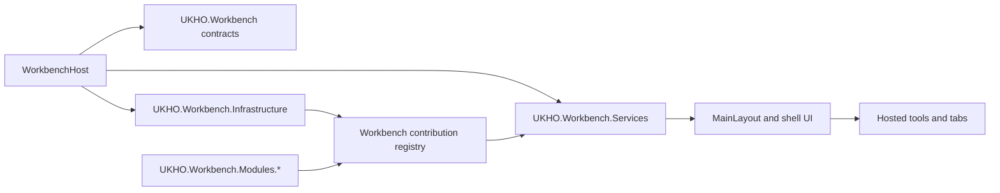
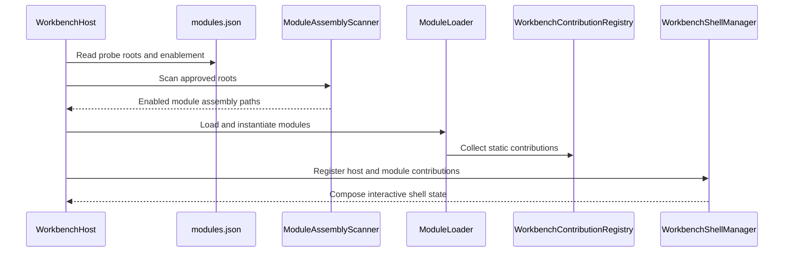

# Workbench architecture

Read this page after [Workbench introduction](Workbench-Introduction) when you want the structural answer to three questions:

1. why Workbench is split across several projects instead of being one large Blazor host
2. why module loading is host-controlled and deliberately bounded
3. where to look first when a Workbench behavior seems to belong to more than one layer

The current Workbench area follows the same architectural instincts as the rest of the repository. Ownership stays visible. Integration concerns stay outward. Feature-specific behavior is allowed to extend the shell, but not to seize control of it.

## The Workbench project map

The current implementation is distributed across one host, three shared Workbench projects, and four module assemblies.

| Project | Responsibility |
|---|---|
| `src/workbench/server/WorkbenchHost` | Hosts the Blazor Server UI, authentication, startup bootstrap, module discovery orchestration, and host-owned fallback tooling. |
| `src/workbench/server/UKHO.Workbench` | Defines the core contracts and models such as `IWorkbenchModule`, `ToolDefinition`, `ActivationTarget`, explorer models, tab models, output contracts, and shell contribution types. |
| `src/workbench/server/UKHO.Workbench.Services` | Orchestrates command routing, tool activation, runtime contribution composition, context projection, shell state, and output session behavior. |
| `src/workbench/server/UKHO.Workbench.Infrastructure` | Reads `modules.json`, resolves probe roots, scans for approved assemblies, and performs bounded reflection-based module loading. |
| `src/Workbench/modules/UKHO.Workbench.Modules.Search` | Contributes the current Search exemplar tools and the best live example of runtime tool participation. |
| `src/Workbench/modules/UKHO.Workbench.Modules.PKS` | Contributes the current PKS exemplar tool. |
| `src/Workbench/modules/UKHO.Workbench.Modules.FileShare` | Contributes the current File Share exemplar tool. |
| `src/Workbench/modules/UKHO.Workbench.Modules.Admin` | Contributes the current Administration exemplar tool. |

That split is not accidental overhead. It lets the repository keep the shell itself stable while still making room for new tools and modules.

If everything lived inside `WorkbenchHost`, every new tool would have a stronger temptation to couple itself to Razor layout details, startup wiring, or host-only services. If everything lived in modules, the shell would stop being a shell and would turn into an uncontrolled collection of feature-specific assumptions. The current split avoids both extremes.

## The architectural idea in one picture

The host owns startup and UI composition. Contracts define what the host, services, and modules are allowed to say to each other. Infrastructure discovers eligible modules. Modules contribute only through the bounded contract surface. Services turn those contributed definitions into runtime shell behavior.

That means most Workbench questions can be answered by asking which side of the boundary the problem belongs to.

## Why the host owns startup

`WorkbenchHost` is responsible for authentication, the Blazor component tree, service registration, and the startup path that reads `modules.json`. In `Program.cs`, the host does the following in order:

1. registers service defaults and shared Workbench infrastructure
2. sets up Blazor Server, Radzen services, HTTP helpers, and Keycloak-backed authentication
3. reads `modules.json` and resolves module probe roots
4. scans probe roots for assemblies matching the approved `UKHO.Workbench.Modules.*` naming convention
5. loads valid modules and lets them register services and static contributions before DI finalization
6. builds the app, replays buffered startup output, registers host-owned fallback tooling, and then applies module contributions to the shell manager

That order is important because it explains why modules do not get to "boot themselves." They are guests inside a host-owned environment. The host decides where discovery happens, which probe roots are trusted, which modules are enabled, and how failures are surfaced.

This is one of the most important current-state facts for the Workbench guide. The module system is extensible, but it is not open-ended or self-authorizing.

## Why the module model is bounded

The bounded model appears in two places that matter immediately when you read the code.

First, each loadable module must expose exactly one concrete `IWorkbenchModule` implementation. That entry point supplies `Metadata` and one `Register(...)` method. The module does not receive `MainLayout`, direct references to shell components, or a free-form host service provider. It receives a `ModuleRegistrationContext` that exposes a small, deliberate registration surface.

Second, the registration context collects only approved contribution types: tools, commands, explorers, explorer sections, explorer items, and static shell contributions. A module can add services before the container is finalized, but even that happens inside a host-created context that keeps the module attributable and constrained.

The effect is architectural rather than cosmetic. The repository wants modules to describe capabilities, not rewrite the shell.

## What the contribution registry is doing

`WorkbenchContributionRegistry` is the host's temporary catalog during startup. It gathers the static definitions contributed by host code and module code before the interactive shell begins composing them.

The registry matters because it gives the shell one stable handoff point. Startup collects definitions first. Runtime composition happens later. That separation keeps module loading and live interaction from collapsing into one tangled path.

It also enforces uniqueness rules. Tool ids, command ids, explorer ids, section ids, and other contribution ids must stay stable and unique. That protects three things at once:

- deterministic rendering and activation behavior
- understandable diagnostics when something is registered incorrectly
- testability, because repeated startup paths can remain idempotent when the same contribution is supplied consistently

## Startup flow in more detail

The important thing to notice is that the shell manager is not the discovery mechanism. By the time the shell manager begins composing the interactive experience, discovery and registration have already happened. That lets the shell manager stay focused on runtime behavior instead of file-system probing and reflection.

## Where runtime ownership lives after startup

Once the host finishes startup, responsibility shifts from infrastructure loading to service-layer orchestration.

- `WorkbenchShellManager` becomes the host-facing façade for shell state and activation.
- `CommandManager` owns command registration and execution routing.
- `ExplorerManager` owns explorer, section, and item composition.
- `RuntimeContributionManager` merges static and active-tool contributions for menus, toolbars, explorer toolbar content, and status surfaces.
- `ToolActivationManager` owns logical activation rules, including tab reuse.
- `WorkbenchOutputService` owns the shared output session.

This split matters because a Workbench defect is often misclassified when you start from the visible UI. If a button does not show up, the problem may be a missing contribution, a command-registration issue, an activation mismatch, or a state-projection issue. `MainLayout` is the final renderer, but it is not always the owner of the behavior you are seeing.

## How the current module set proves the architecture

The current Workbench modules are still exemplar tools, but they already validate the architectural model in several important ways.

- The Search module proves one module can contribute several explorers, several tools, host-scoped commands, and tool-scoped runtime actions.
- The Search query tool proves an active tool can publish runtime menu, toolbar, and status-bar contributions through `ToolContext` without taking over the shell.
- The PKS, File Share, and Admin modules prove separate assemblies can be discovered and merged into one shell-owned experience.
- The host-owned overview tool proves the shell can still run even when no module explorer is available or when module startup partially fails.

This is why the Workbench area deserves deep documentation even before the tools become richer. The shell contracts and ownership rules are already real, and those are exactly the parts that future contributors are most likely to misunderstand if they read only the visible Blazor markup.

## Missing-content check from the retired shell page

The older single-page shell document mixed project responsibilities, startup behavior, module loading, runtime contribution ownership, and shell-surface explanation into one long historical page. This architecture chapter intentionally absorbs the parts of that page that belong to structural understanding:

- project responsibility mapping
- bounded module discovery and loading
- the startup sequence from host bootstrap into shell registration
- the reason modules contribute through contracts rather than direct shell access

The remaining shell-surface, command, tab, and output topics are moved into the later guide pages where they can be explained with more depth instead of being buried in one catch-all document.

## Common architecture-reading mistakes

### Mistake 1: assuming Workbench is just a UI project

The shell is visibly a Blazor Server host, but that is only the outermost surface. The command model, activation model, contribution model, and output model all live behind it. Treating Workbench as "just pages and components" hides the actual extension boundaries.

### Mistake 2: assuming modules own their own shell

A module contributes capabilities. It does not own layout, startup discovery, authentication, or the final composition logic. If you find yourself wanting a module to reach directly into `MainLayout`, you are usually crossing an ownership boundary the current design is deliberately protecting.

### Mistake 3: starting from a module instead of from the shell contract

When you need to add a tool, it is tempting to copy the nearest existing module and start changing it. Read the contract layer first. You will make better decisions once you understand what `IWorkbenchModule`, `ModuleRegistrationContext`, `ActivationTarget`, and `ToolContext` are each supposed to do.

## Recommended next pages

- Continue to [Workbench shell guide](Workbench-Shell-Guide) for the visible shell surfaces and their ownership boundaries.
- Continue to [Workbench modules and contributions](Workbench-Modules-and-Contributions) for the detailed registration model.
- Continue to [Workbench commands and tools](Workbench-Commands-and-Tools) once you want the runtime action and activation path.
- Return to [Workbench introduction](Workbench-Introduction) if you need the reading routes again.
