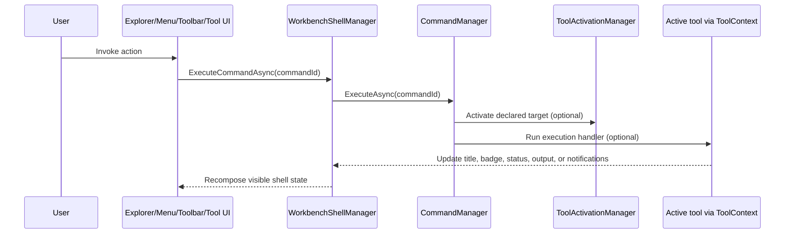

# Workbench commands and tools

Read this page after [Workbench modules and contributions](Workbench-Modules-and-Contributions) when you want to understand how a Workbench action travels from a visible shell surface into one deterministic runtime path.

This chapter matters because Workbench deliberately does not let each surface invent its own behavior. Explorer items, menu items, toolbar buttons, and tool-local actions all converge on the same command model. That convergence is what keeps the shell predictable even when modules contribute new tools.

## The core idea

In the current implementation, a **command** is the shared action abstraction for Workbench. The command itself is described by `CommandContribution` in `src/workbench/server/UKHO.Workbench/Commands/CommandContribution.cs`, and routing is owned by `CommandManager` in `src/workbench/server/UKHO.Workbench.Services/Commands/CommandManager.cs`.

That means a command is not just a button click handler. It is a shell-level declaration with a stable identifier, display name, ownership boundary, optional activation target, and optional execution handler. The shell uses that declaration so different surfaces can trigger the same action without duplicating logic.

The design is intentionally simple but strict.

- a command must have a stable id
- a command must resolve to either an activation target, executable behavior, or both
- a tool-scoped command must identify the owning tool
- every surface routes through the same shell-owned execution path

Those rules are what keep Workbench from turning into several disconnected UI models.

## How routing works in practice

`CommandManager.ExecuteAsync(...)` performs two responsibilities in a fixed order.

1. It looks up the command contribution by id.
2. If the command declares an `ActivationTarget`, it opens or focuses that target first.
3. If the command declares an `ExecutionHandler`, it runs that handler next.

That ordering is important. A host-owned command can be purely declarative and only open a tool. A richer tool-scoped command can both ensure the correct tool is active and then perform custom behavior against the current `ToolContext`.

The key architectural point is that the shell still owns routing even when the action originates inside a tool. A tool asks the shell to do something. It does not take over command execution for itself.

## Host-owned commands versus tool-scoped commands

The current model uses `CommandScope` to distinguish two different ownership stories.

### Host-owned commands

Host-owned commands are available independently of any active tool instance. They are the right choice when the action is really about Workbench navigation or shell-level activation.

Typical examples include explorer-driven commands that open a tool for the first time. In `SearchWorkbenchModule`, commands such as `command.module.search.open-query` and `command.module.search.open-ingestion` are host-scoped because they represent shell navigation into a tool target.

### Tool-scoped commands

Tool-scoped commands belong to one tool definition and only make sense when that tool is active. They still route through the shell, but their intent is local to the active tool surface.

The Search query module demonstrates this with `Run sample Search query` and `Reset Search query`. Those commands are scoped to `tool.module.search.query`, and their handlers update runtime title, badge, selection, status contributions, and notifications through `ToolContext`.

This distinction matters because it stops the command catalog from becoming ambiguous. If a command is really about activating a tool, it belongs at the host level. If it only makes sense inside a specific tool's active runtime, it should be tool-scoped and attributable.

## What an activation target actually means

`ActivationTarget` in `src/workbench/server/UKHO.Workbench/Tools/ActivationTarget.cs` is the shell contract that describes what should be opened or focused. It carries:

- the tool id
- the hosting region
- the logical tab key used for reuse decisions
- the optional parameter identity used to distinguish variants of the same tool
- initial title and icon values used until the active view publishes runtime metadata

The important part is the **logical tab key**. Workbench does not decide tab reuse by component type alone. It decides reuse by a stable identity contract. If the logical identity matches, the existing tab is focused. If the identity differs, a new tab can be created.

That is why `ActivationTarget` belongs in the command chapter as well as the tab chapter. Commands often carry the activation contract that later determines tab behavior.

## Why explorer items are not a separate action system

Explorer items feel like navigation, but they are not a second routing model. Each `ExplorerItem` points at a `CommandId` and also carries its declarative `ActivationTarget` for clarity and diagnostics.

That gives the shell a useful property: the left-side explorer, top-level menus, in-tab toolbar, and tool-local buttons can all point back to the same command identity.

Without that indirection, Workbench would eventually accumulate four subtly different ways to open the same tool.

## `ToolContext` is the bounded runtime bridge

Once a tool is active, it receives a `ToolContext` parameter. `ToolContext` exists so the hosted tool can participate in shell behavior without reaching into `MainLayout`, `WorkbenchShellManager`, or service internals directly.

Today `ToolContext` allows an active tool to:

- open or focus another tool through the shell
- invoke a command by id
- update its runtime title, icon, and badge
- replace active-tool runtime menu, toolbar, and status contributions
- publish its current selection summary
- inspect fixed context values
- raise user-safe notifications

That list is deliberately small. It gives a tool the runtime abilities it genuinely needs while still keeping shell ownership intact.

## A worked example: the Search query tool

The Search query example in `src/Workbench/modules/UKHO.Workbench.Modules.Search` is the best current tutorial for understanding the command model.

1. `SearchWorkbenchModule` registers the tool definition, its host-owned open command, and its tool-scoped sample commands.
2. `SearchQueryTool` publishes runtime menu and toolbar contributions when the `ToolContext` first arrives.
3. The visible menu and in-tab toolbar are recomposed by the shell from those runtime contributions.
4. When the user triggers `Run sample query`, the tool asks `ToolContext` to invoke the tool-scoped command.
5. The command handler updates shell metadata and raises a notification through `ToolContext`.
6. `WorkbenchShellManager` recomposes the shell, and `MainLayout` reflects the updated title, badge, status messages, and output history.

That single example proves most of the model:

- declarative command registration
- tool-scoped ownership
- runtime menu and toolbar publication
- command-centric tool interaction
- shell-owned notification and output handling

## What not to do when adding commands

### Do not bypass the command manager

If a tool button directly reaches into host services to do shell work, the action becomes harder to trace, harder to test, and inconsistent with explorer or menu invocation. Route through commands instead.

### Do not make every command tool-scoped

If the action is really just “open this tool,” keep it host-scoped. Tool scope should describe ownership, not merely proximity.

### Do not use unstable identifiers

The registry and managers assume ids are stable. If command ids drift casually, diagnostics, tests, menu composition, and explorer routing all become less trustworthy.

## Recommended next pages

- Continue to [Workbench tabs and layout](Workbench-Tabs-and-Layout) to see how activation targets become tabs.
- Continue to [Workbench tutorials](Workbench-Tutorials) for step-by-step extension recipes that apply this command model.
- Continue to [Workbench troubleshooting](Workbench-Troubleshooting) if commands are registered but not behaving as expected.
