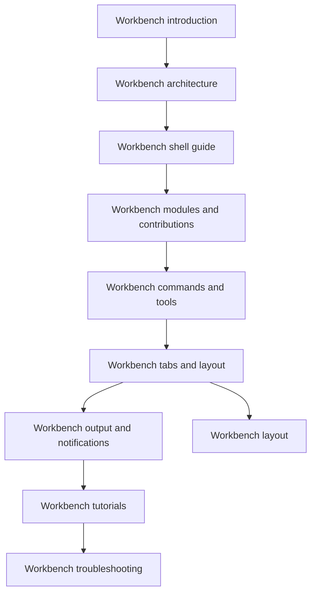

# Developer's Guide to Workbench

Use this page as the front door to the Workbench documentation set.

`Workbench` is the repository's desktop-like Blazor Server host for developer tooling. It is not a general-purpose website and it is not a second copy of the application under test. It is a shell that gives repository tools one shared place to load, activate, report state, and surface diagnostics without making every tool own its own navigation, layout, or infrastructure bootstrap.

That distinction matters when you first read the source tree. The visible UI lives in `src/workbench/server/WorkbenchHost`, but the important design decision is broader than one Blazor layout. The repository splits Workbench into contracts, services, infrastructure, host composition, and loadable module assemblies so that new tools can extend the environment without taking control of the shell.

## When to read this guide

Read this guide when you need to understand any of the following:

- why the repository has a dedicated Workbench host at all
- how `WorkbenchHost`, `UKHO.Workbench`, `UKHO.Workbench.Services`, and `UKHO.Workbench.Infrastructure` divide responsibility
- how modules such as `UKHO.Workbench.Modules.Search` and `UKHO.Workbench.Modules.FileShare` are discovered and allowed into the shell
- how commands, explorer items, tabs, output, and notifications fit together at runtime
- how to add a new dummy or real tool without bypassing the bounded Workbench model

If you are new to the repository, read [Glossary](Glossary), [Solution architecture](Solution-Architecture), and [Architecture walkthrough](Architecture-Walkthrough) first. Those pages explain the repository-wide language and layering that Workbench builds on.

## What Workbench is today

The current Workbench implementation already proves the architectural model in running code, even though the contributed business tools are still exemplar or dummy surfaces.

Today the host provides:

- a desktop-like shell rendered by Blazor Server
- a host-owned overview tool that gives the shell a safe fallback surface
- host-controlled startup, module discovery, and authentication wiring
- tab-aware activation rules so logical targets are focused rather than duplicated
- a shared output stream and notification path for session history
- a bounded module model that lets feature assemblies contribute tools without taking ownership of shell chrome

Today the module map provides:

- `UKHO.Workbench.Modules.Search`, with `Search query`, `Search ingestion`, and `Ingestion rule editor`
- `UKHO.Workbench.Modules.PKS`, with `PKS operations`
- `UKHO.Workbench.Modules.FileShare`, with `File Share workspace`
- `UKHO.Workbench.Modules.Admin`, with `Administration`

Those tools are intentionally lightweight, but they are still important. They exercise the real shell contracts: command registration, explorer composition, activation targets, runtime menu and toolbar updates, output, notifications, and tab reuse. That means the guide below is about the live implementation model, not about a speculative future design.

## Reading order inside the guide

Follow the pages in this order when you want the guide to read like a connected technical chapter sequence instead of a loose reference set.

- [Workbench architecture](Workbench-Architecture) explains why the Workbench area is split across several projects and why the host insists on bounded module startup.
- [Workbench shell guide](Workbench-Shell-Guide) explains the visible shell surfaces and the ownership rules behind them.
- [Workbench modules and contributions](Workbench-Modules-and-Contributions) explains how modules register tools, explorers, commands, and contribution points.
- [Workbench commands and tools](Workbench-Commands-and-Tools) explains command routing, activation targets, `ToolContext`, and the difference between host-owned and tool-scoped actions.
- [Workbench tabs and layout](Workbench-Tabs-and-Layout) explains logical tab identity, explorer-driven opening, overflow behavior, and the relationship to the shared layout primitives.
- [Workbench output and notifications](Workbench-Output-and-Notifications) explains the shell-wide session trace, output filtering, notification replay, and why the status bar is intentionally light.
- [Workbench tutorials](Workbench-Tutorials) turns the concepts into concrete extension recipes.
- [Workbench troubleshooting](Workbench-Troubleshooting) helps you move from symptoms to the right ownership layer when something behaves unexpectedly.
- [Workbench layout](Workbench-Layout) remains the deeper component-level reference for the `UKHO.Workbench.Layout` grid and splitter primitives that the shell uses.

## Reading routes by audience

### If you are new to Workbench

Start with [Workbench architecture](Workbench-Architecture), then read [Workbench shell guide](Workbench-Shell-Guide) and [Workbench modules and contributions](Workbench-Modules-and-Contributions). That route explains the model before it asks you to think about specific command ids, activation targets, or output behaviors.

Most new readers get lost when they start from a single `.razor` file and assume the visible shell markup owns everything. In this repository, the visible markup is only one layer. The command model, activation model, contribution model, and module-loading model all sit behind it. Read the conceptual pages first so the later runtime detail has somewhere to attach.

### If you are extending or maintaining the shell

Start with [Workbench architecture](Workbench-Architecture), then move directly into [Workbench commands and tools](Workbench-Commands-and-Tools), [Workbench tabs and layout](Workbench-Tabs-and-Layout), and [Workbench output and notifications](Workbench-Output-and-Notifications).

That route is better for maintainers because shell changes usually cross several boundaries at once. A change that looks like "just a button" often depends on command registration, active-tool recomposition, tab identity rules, and output or notification behavior. Reading the deeper runtime pages together makes those dependencies visible earlier.

### If you are contributing a module or tool

Start with [Workbench modules and contributions](Workbench-Modules-and-Contributions), continue to [Workbench commands and tools](Workbench-Commands-and-Tools), and then read [Workbench tutorials](Workbench-Tutorials).

This route matters because modules are intentionally not allowed to reach into `MainLayout` or host startup internals. The repository wants tool authors to think in bounded contributions and activation targets rather than in direct shell manipulation. The tutorial page shows that pattern in practice.

## Terminology that matters in this guide

This guide intentionally uses the same terminology as [Glossary](Glossary) and the wider architecture pages.

- A **module** is a loadable assembly implementing `IWorkbenchModule`.
- A **tool** is an activatable capability hosted inside the shell.
- A **command** is the shared action abstraction used by explorer items, menus, toolbars, and tool-driven actions.
- A **contribution** is a bounded piece of UI or behavior that the shell knows how to compose.
- A **ToolContext** is the approved runtime bridge back into shell behavior.
- The **output panel** is the shell-owned, session-scoped trace surface.

Keeping those words stable matters because the same concepts appear in code, tests, and the wiki. If you start calling a tool a page, or a contribution a plugin hook, the repository becomes harder to reason about because the layering intent disappears behind inconsistent language.

## A quick mental model before you continue

If you want one sentence to carry into the rest of the guide, use this one: Workbench is a host-owned shell that composes bounded module and tool contributions into one desktop-like developer environment.

That sentence explains most of the design choices that follow.

- The shell stays host-owned because navigation, layout, output, authentication, and startup policy need one place of control.
- Modules stay bounded because the repository wants extensibility without letting every tool rewrite shell behavior.
- Commands and activation targets stay central because explorer clicks, menu items, toolbar buttons, and tool-internal actions all need to participate in the same runtime path.
- Output stays shell-owned because startup history, notifications, and diagnostics need one session-wide trace instead of scattered local logs.

## Recommended next pages

- Continue to [Workbench architecture](Workbench-Architecture) for the project map and startup model.
- Continue to [Workbench shell guide](Workbench-Shell-Guide) if you already know the project split and want to understand the visible chrome.
- Return to [Home](Home) if you need to switch back to a repository-wide reading path.
- Return to [Glossary](Glossary) if any Workbench term still feels ambiguous.
