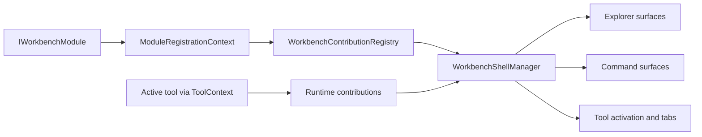

# Workbench modules and contributions

Read this page after [Workbench shell guide](Workbench-Shell-Guide) when you want to understand how the shell becomes populated with explorers, tools, commands, and shell surfaces without giving modules direct control over the host.

This chapter is the heart of the Workbench model. If you understand this page, most of the later command, tab, and tutorial material will make sense more quickly.

## The central idea

A Workbench module is a loadable assembly that describes capabilities through bounded contracts. It does not receive direct references to `MainLayout`, it does not own shell startup, and it does not patch UI surfaces directly. Instead it contributes approved definitions that the host and Workbench services later compose into runtime behavior.

That model is stricter than a loose plugin system, but the strictness is intentional. The repository wants extensibility without turning the shell into an unbounded integration surface.

## The module entry point

Each module assembly must expose exactly one concrete `IWorkbenchModule` implementation. That interface is deliberately small:

- `Metadata` identifies the module for configuration and diagnostics
- `Register(...)` receives a `ModuleRegistrationContext` during startup

The small size of the contract is itself part of the design. A large startup interface would tempt modules to do too much. The current contract encourages modules to stay focused on declarations and bounded service registration.

## What the registration context allows

`ModuleRegistrationContext` is the approved startup surface a module receives from the host. It lets a module:

- add services to the mutable service collection before DI finalization
- add tools
- add commands
- add explorers, explorer sections, and explorer items
- add static explorer-toolbar contributions
- add static menu, toolbar, and status-bar contributions

What it does not allow is just as important.

It does not let a module:

- manipulate `MainLayout`
- bypass the shell manager
- take ownership of startup discovery
- assume it can alter shell structure directly
- register arbitrary runtime UI chrome outside the supported contribution model

That is why the context deserves careful reading. It shows the extension story the repository actually supports.

## Static contributions versus runtime contributions

There are two kinds of contribution in the current model.

### Static contributions

Static contributions are registered during startup through the module registration context or through host startup code. They include explorer items, baseline commands, and shell surfaces that should exist before any tool becomes active.

### Runtime contributions

Runtime contributions come from the active tool through `ToolContext`. These are the menu, toolbar, and status-bar items that exist only while a specific tool instance is active.

This split matters because it keeps startup and live interaction separate.

- static contributions explain what the Workbench can offer in principle
- runtime contributions explain what the active tool needs right now

Without that separation, either startup would become too dynamic to reason about, or active tools would be stuck with a shell that never reflects task-specific context.

## The contribution model in one diagram

The contribution registry is the startup handoff point. `WorkbenchShellManager` and its supporting managers are the runtime composition point. `ToolContext` is the bounded runtime path back from an active tool to the shell.

## Current module map

The current Workbench module set is small enough to understand quickly, but broad enough to demonstrate the model well.

| Module | Current explorers and tools | Why it matters |
|---|---|---|
| `UKHO.Workbench.Modules.Search` | `Search query`, `Search ingestion`, `Ingestion rule editor` | Proves one module can contribute multiple explorers, multiple tools, and tool-scoped runtime commands. |
| `UKHO.Workbench.Modules.PKS` | `PKS operations` | Proves a second feature area can join the shell through the same bounded startup path. |
| `UKHO.Workbench.Modules.FileShare` | `File Share workspace` | Connects the Workbench story to the repository's File Share tooling direction. |
| `UKHO.Workbench.Modules.Admin` | `Administration` | Proves a general administrative module can coexist with feature-specific modules. |

The Search module is currently the richest example because it includes both simple tool activation and runtime shell participation.

## Why explorers, sections, and items are separate concepts

The separation between explorer, explorer section, and explorer item is deliberate.

- an **explorer** is the broad workspace category selected from the activity rail
- an **explorer section** groups related items inside the explorer pane
- an **explorer item** is the actual selectable and activatable entry presented to the user

This matters because the shell wants the left side to remain navigable as the tool set grows. If every tool were flattened into one long rail or one long menu, the shell would stop behaving like a tool host and would become harder to scan.

## Why commands are registered separately from explorer items

Explorer items are not the command system. They are one surface that points into the command system.

That distinction gives the repository two useful properties.

First, the same action can be surfaced in several places: explorer, menu, toolbar, or tool-internal buttons. Second, activation behavior can stay centralized. The shell does not need four different ways to open a tool depending on where the user clicked.

This is why module registration usually adds both an explorer item and a command contribution. The explorer item describes where the action appears in navigation. The command describes what the action actually is.

## How the host stays in control

Even though modules can register services, the host still stays in control in several important ways.

- `modules.json` decides which modules are enabled and where they may be discovered
- the assembly scanner only considers names matching `UKHO.Workbench.Modules.*`
- duplicate or conflicting contribution ids are rejected by the registry
- module load failures are captured with a clear failure stage and preserved in diagnostics and output
- the host still supplies the fallback overview tool and baseline shell behavior

That combination gives the module model discipline. A module can extend the Workbench, but it cannot quietly redefine what Workbench is.

## What a healthy module should look like

A healthy Workbench module in this repository usually has these characteristics:

- one clear `IWorkbenchModule` entry point
- stable ids for explorers, sections, items, tools, and commands
- a small amount of startup registration code
- tool components that use `ToolContext` for runtime behavior instead of trying to reach around the shell
- descriptions and display names that make sense in explorer and command surfaces

A module is becoming unhealthy when it starts to need direct layout knowledge, shell-only state, or ad hoc runtime shortcuts that bypass the command and activation model.

## Missing-content check from the retired shell page

This chapter intentionally absorbs and expands the module-related material that used to be compressed inside `Workbench-Shell.md`:

- the approved module naming convention and discovery boundary
- the role of `modules.json`
- the existence of the bounded `IWorkbenchModule` contract
- the current four-module map and the tools each module contributes
- the distinction between startup registration and runtime shell participation

The older page treated those items as one more list in a larger shell summary. Here they are promoted into a full explanation because they are one of the most conceptually dense parts of the Workbench model.

## Common mistakes when extending the model

### Treating a module as if it were a mini-host

If your extension needs to own its own startup orchestration or shell structure, you are probably no longer describing a Workbench module. You are asking for a host-level change.

### Reusing unstable identifiers

The registry expects stable ids. If tool ids or command ids drift casually, activation reuse, contribution composition, diagnostics, and tests all become harder to trust.

### Putting runtime behavior into startup registration

Startup registration is for declaring what exists. Runtime behavior belongs in commands, activation logic, and `ToolContext` updates once a tool instance is active.

## Recommended next pages

- Continue to [Workbench commands and tools](Workbench-Commands-and-Tools) for the shared action and activation model that explorer items feed into.
- Continue to [Workbench tutorials](Workbench-Tutorials) for worked examples that build on this contribution model.
- Return to [Workbench architecture](Workbench-Architecture) if you need the host and infrastructure split again.
