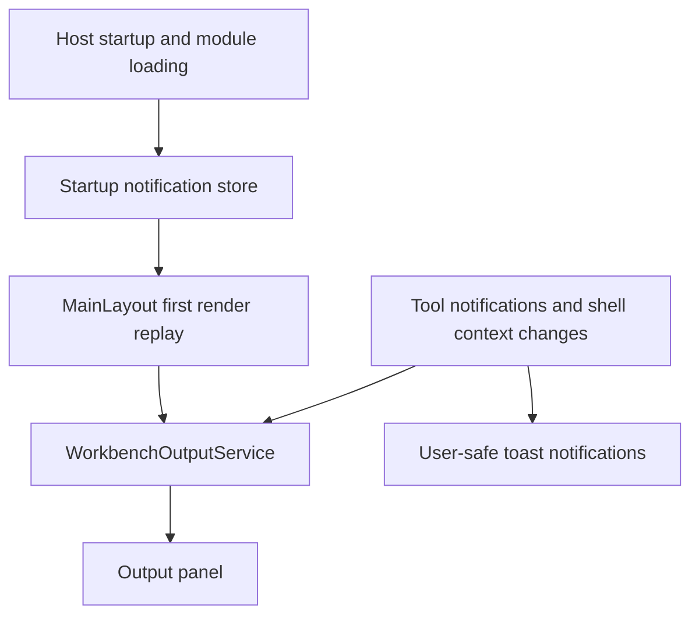

# Workbench output and notifications

Read this page after [Workbench tabs and layout](Workbench-Tabs-and-Layout) when you want to understand how the shell reports what happened during startup and throughout the session, why the output panel is now the durable history surface, and how user-safe notifications relate to that output stream.

This chapter matters because Workbench deliberately separates two ideas that are easy to blur together.

- a **notification** is the short-lived message the user sees now
- the **output panel** is the shell-owned historical record of what happened during the session

That split is one of the most important current-state design choices in the Workbench shell.

## The output stream is shell-owned session history

`WorkbenchOutputService` in `src/workbench/server/UKHO.Workbench.Services/Output/WorkbenchOutputService.cs` owns a bounded in-memory stream of immutable `OutputEntry` values and one shared `OutputPanelState` snapshot.

The service keeps the newest `250` entries, trims older entries when the limit is exceeded, and exposes events for both entry changes and panel-state changes. That means the output model is not a component-local console. It is a shell-level session service.

This ownership matters because several things need one shared historical home:

- module discovery and module-load outcomes during startup
- user-safe notifications raised by tools or by host startup
- shell context snapshots and status messages
- ongoing diagnostics and action results that should remain visible after the user switches tabs

## Why the status bar is intentionally light

The current status bar mostly keeps the `Output` toggle and the hidden unseen-severity indicator. That can look sparse if you expect a traditional status strip full of persistent text.

The reason is not missing implementation. It is a deliberate shift in responsibility.

Longer-lived shell state now belongs in the output history. The status bar stays focused on immediate affordances, while the output panel keeps the durable session trace. This makes the shell easier to scan and gives diagnostics one obvious home.

## How notifications are mirrored

`WorkbenchShellManager` raises user-safe notifications through `NotificationRaised`. `MainLayout` then does two things:

1. it shows a toast through Radzen's notification service
2. it writes the same safe summary and detail into the shared output stream under the `Notifications` source

That dual path is important.

The user gets an immediate visible cue, but the message is also preserved after the toast disappears. Tools therefore do not need to invent their own notification history.

## Startup output versus runtime output

Startup output is buffered before the interactive shell is ready. `Program.cs` writes module discovery summaries, successes, and failures into `WorkbenchStartupNotificationStore`, and `MainLayout.OnAfterRenderAsync` replays them into the output service once the shell can safely render the UI.

Runtime output is simpler. Once the shell is interactive, notifications, context updates, status updates, and later diagnostics write directly into the shared output service.

The result is one continuous session story instead of a split between “messages from startup” and “messages from later.”

## What the panel state remembers

`OutputPanelState` in `src/workbench/server/UKHO.Workbench/Output/OutputPanelState.cs` stores session-scoped view state without mutating output entries themselves. The panel state tracks:

- whether the panel is visible
- the center-pane and output-pane height tokens
- whether auto-scroll is enabled
- whether wrapping is enabled
- the minimum visible output level
- the most severe unseen level while the panel is hidden
- which entries are expanded in the current view

This design is useful because the historical output and the current view state are different concerns. The entries describe what happened. The panel state describes how the current user session is viewing that history.

## The current output workflow

When the panel is visible, `MainLayout` synchronizes the retained output history into a hosted terminal-style surface. The layout supports the current operator workflow:

- open and collapse the panel from the status bar
- clear the retained session stream
- toggle auto-scroll
- scroll to the newest retained output
- search within the terminal surface
- copy selected output text
- switch minimum visible level between `Error`, `Warning and above`, `Info and above`, and `Debug`

Those are not arbitrary conveniences. They reflect the idea that Workbench sessions produce ongoing technical trace, and that developers need an inspection surface rather than only ephemeral UI alerts.

## Why visibility filtering matters

The output service keeps retained entries even when the panel only shows a filtered subset. That distinction matters for two reasons.

First, the user can tighten the view to `Error` or `Warning and above` without losing historical information. Second, the hidden unseen-severity indicator only considers entries at or above the current visible threshold, so the shell does not surface a hidden warning indicator for entries the current filter intentionally suppresses.

That is a good example of the Workbench model being careful rather than flashy. The shell tries to make the output signal trustworthy.

## A practical reading of current sources

If you want to trace the output path in code, read these areas together.

- `src/workbench/server/WorkbenchHost/Program.cs` for startup buffering and module-load reporting
- `src/workbench/server/WorkbenchHost/Components/Layout/MainLayout.razor.cs` for replay, projection, search, copy, scroll, and panel toggling
- `src/workbench/server/UKHO.Workbench.Services/Output/WorkbenchOutputService.cs` for retention and panel-state ownership
- `src/workbench/server/UKHO.Workbench.Services/Shell/WorkbenchShellManager.cs` for runtime notification and status/context projection

That sequence shows the full handoff from host startup into shell-owned session history.

## Common misunderstandings

### “The output panel is empty, so nothing happened.”

The panel may be collapsed, filtered above the entry level you expect, or simply showing retained output after the first interactive render. Check visibility and the minimum visible level first.

### “If I saw the toast, I do not need to check output.”

Toasts are the transient surface. Output is the historical surface. If you need to understand the session later, the panel is the authoritative record.

### “The status bar should show all of this directly.”

The current design intentionally moved durable shell history out of the status bar and into the output panel. The lighter status bar is part of the model, not a missing implementation step.

## Recommended next pages

- Continue to [Workbench tutorials](Workbench-Tutorials) for recipes that raise notifications and participate in shell output correctly.
- Continue to [Workbench troubleshooting](Workbench-Troubleshooting) when the panel looks empty or module-load diagnostics do not match what you expected.
- Return to [Workbench shell guide](Workbench-Shell-Guide) if you need the surrounding layout and ownership context again.
