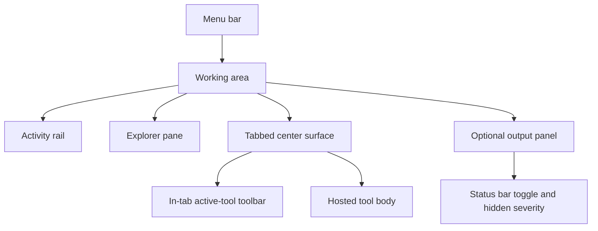
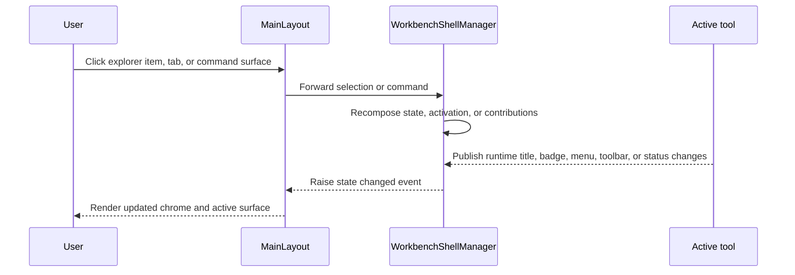

# Workbench shell guide

Read this page after [Workbench architecture](Workbench-Architecture) when you want to understand what the user actually sees in the current Workbench shell and why those surfaces are arranged the way they are.

The current shell is intentionally desktop-like. That does not simply mean "it has panes." It means the shell behaves like a host environment for tools: it keeps navigation chrome stable, hosts multiple open tools, preserves in-memory state while tabs stay open, and separates long-lived session output from the active working surface.

## The shell in one view

The diagram is intentionally simple because the important point is ownership. The shell is made of a few stable host-owned surfaces, and each surface exists for a different reason.

## Menu bar

The top row is the shell-owned menu bar. It stays above the rest of the layout and presents the composed menu contributions for the current shell state. The temporary appearance toggle also lives there today.

Why keep it host-owned? Because menu behavior needs to stay consistent regardless of which tool is active. A tool may contribute runtime menu items through the approved contribution path, but the bar itself remains a shell responsibility. That keeps keyboard-level or chrome-level expectations predictable and prevents tools from inventing their own top-level navigation model.

## Activity rail

The leftmost narrow rail presents explorer contributions as icon-first selectors. This surface answers the question, "Which logical workspace am I in right now?" rather than the question, "Which specific tool is open?"

That distinction matters. The activity rail switches explorer context. The tab strip and command system manage active tools. If you blur those ideas together, the shell becomes harder to reason about because one click starts doing too many unrelated things.

The current implementation keeps the rail fixed and icon-led so the Workbench reads like a desktop host rather than a stacked web menu. Tooltips carry the explorer labels instead of leaving rail text visible all the time.

## Explorer pane

The explorer pane is the left-side detail surface that expands the currently active explorer into sections and explorer items.

This pane is intentionally declarative. It renders explorer sections and explorer items from contributions rather than from hard-coded navigation markup. Single-click selects an explorer item. Double-click opens or focuses it through the shared command and activation path.

That two-step interaction is important because it mirrors the shell's broader model. Selection and activation are not the same operation. Selection affects explorer state. Activation affects tools and tabs.

## Center surface and hosted tools

The center surface is where tool content actually runs. It is not a single page outlet. It is a tab-aware host region that can hold several open tool instances while keeping inactive tabs mounted.

Keeping inactive tabs mounted is a deliberate shell choice. It preserves in-memory tool state while a tab remains open, which makes Workbench feel more like a desktop tool host and less like a web page that tears down state every time you move away from it.

When the final tab closes, the shell returns to an explicit empty state instead of pretending there is always an active document. That makes tab lifecycle easier to reason about and keeps focus rules honest.

## In-tab active-tool toolbar

The active-tool toolbar no longer lives as a permanent full-width shell row above the working area. Instead, toolbar contributions for the active tool are rendered inside the active tab, directly under the tab strip.

This is a small but important design decision.

If the toolbar lived permanently in the outer chrome, it would imply that tool-local actions belong to the shell. By moving the toolbar into the active tab surface, the UI makes the ownership rule visible: these actions belong to the active tool, not to the Workbench as a whole.

The shell still owns the surface and the rendering rules, but the visual placement now matches the architectural boundary more closely.

## Output panel

The output panel is the shell-owned historical trace for the session. It is collapsed by default and opens as a full-width bottom pane between the working area and the status bar.

This panel is not just a console replacement. It exists because Workbench has several kinds of information that should outlive the currently active tab:

- startup module discovery and module-load results
- user-safe notifications that were also shown as toasts
- shell context and state transitions
- ongoing diagnostics written by the shell or host

A tool can still raise notifications through `ToolContext`, but the shell owns how those notifications become historical session output.

## Status bar

The current status bar is intentionally light. It mainly carries the `Output` toggle and the hidden unseen-severity indicator used while the output panel is collapsed.

That is not because status information stopped mattering. It is because the shell now treats the output panel as the durable historical surface. The status bar is for immediate affordances. The output panel is for history.

This is one of the clearest examples of the Workbench documentation needing more depth than the older shell page gave it. Without the rationale, the lighter status bar can look like a missing feature. In reality it reflects a specific design move: long-lived diagnostics were centralized in the output panel instead of being scattered through short-lived status text.

## Why the shell feels desktop-like instead of web-like

The Workbench shell uses familiar web technology, but it deliberately avoids behaving like a simple website with page navigation.

- the menu bar spans the whole top edge
- the rail and explorer stay visible as navigation context
- tools open into tabs rather than replacing the whole route surface
- the output panel behaves like a session console, not a page-local alert box
- splitters and resizable panes make the shell behave more like a workstation surface than a document site

That design choice matters because the repository uses Workbench as a tool host, not as a marketing or content site. The shell needs to support repeated task switching, stateful tools, and long-running developer sessions.

## How the shell composes contributions

The visible shell is not hard-coded to one fixed set of commands and buttons. Instead, it composes a mixture of host-owned contributions and active-tool runtime contributions.

- static menu, toolbar, explorer-toolbar, and status items can be registered at startup
- active tools can replace their runtime menu, toolbar, and status contributions through `ToolContext`
- the shell recomposes those surfaces whenever the active tool or shell state changes

This gives the Workbench a useful balance. The shell stays stable and recognizable, but the active tool can still make the chrome relevant to the task the user is performing.

## Shell flow from user action to visible change

The important thing here is that the shell markup is reacting to composed state. It is not inventing that state by itself.

## Missing-content check from the retired shell page

This chapter intentionally absorbs the parts of the older standalone shell page that belong to shell-surface understanding:

- the shape of the desktop-like shell
- the relationship between menu bar, activity rail, explorer, center tabs, output, and status surfaces
- the move of active-tool toolbar content into the tab surface
- the role of the output panel as the shared session history
- the reasoning behind the shell's desktop-like rather than web-like presentation

The older page also contained command, module, tab, and output details that are now expanded in their own deeper chapters instead of being compressed into one place.

## Where people usually get confused

### Confusing explorer navigation with tool tabs

The explorer chooses a workspace context and offers activation targets. It is not the same thing as the currently open tab set. Once you understand that separation, the shell's left pane and center surface stop feeling redundant.

### Assuming the active tool owns the shell chrome

An active tool can influence the visible chrome through contributions, but it does not own the shell. That is why the contribution APIs are bounded and why the host still decides how and where those contributions render.

### Treating the output panel as optional decoration

The output panel is now the historical record of the session. If you ignore it, you will miss startup diagnostics, replayed notifications, and the trace of shell state changes that the status bar no longer keeps around.

## Recommended next pages

- Continue to [Workbench modules and contributions](Workbench-Modules-and-Contributions) for the bounded registration model that feeds the shell.
- Continue to [Workbench tabs and layout](Workbench-Tabs-and-Layout) for the center-surface lifecycle and splitter behavior.
- Continue to [Workbench output and notifications](Workbench-Output-and-Notifications) for the output-first runtime model.
- Return to [Workbench architecture](Workbench-Architecture) if you need the project and startup map again.
