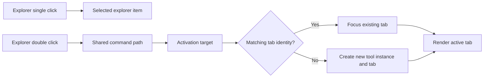

# Workbench tabs and layout

Read this page after [Workbench commands and tools](Workbench-Commands-and-Tools) when you want to understand what happens after a command resolves to an activation target: which tab opens, when an existing tab is reused, why inactive views remain mounted, and how the desktop-like shell layout supports that behavior.

This chapter sits at the point where Workbench stops being an abstract composition model and starts feeling like a real desktop tool host.

## Tabs are logical identities, not just visible labels

The current shell does not treat a tab as “whatever is currently rendered.” It treats a tab as the visible representation of a stable logical target.

That logical identity comes from `ActivationTarget.CreateTabIdentity()` in `src/workbench/server/UKHO.Workbench/Tools/ActivationTarget.cs`. The identity combines:

- the tool id
- the hosting region
- the logical tab key
- the optional parameter identity

This is the reason Workbench can reliably focus an existing tab instead of duplicating it. The shell is not comparing page titles. It is comparing bounded activation identity.

## How open-or-focus really works

`ToolActivationManager` owns the activation rule. It looks up the requested tool definition, asks the shell state whether a matching logical target already exists, and either focuses that tab or creates a new runtime tool instance with a fresh `ToolContext`.

That sounds small, but it explains several visible behaviors at once.

- reopening the same singleton-style tool usually focuses the existing tab
- different parameter identities can justify separate tabs for the same tool type
- active-tool metadata can change without changing the underlying logical reuse rule

The result is a shell that behaves more like an IDE or desktop workbench than like a website with route replacement.

## The current user interaction model

The left-side explorer and the center tab strip are related, but they do different jobs.

- the **activity rail** chooses a broad explorer context
- the **explorer pane** lists activatable items in that context
- a **single click** selects an explorer item without opening it
- a **double click** routes through the shared command path and opens or focuses the matching tab
- the **tab strip** manages already open logical targets

That distinction is deliberate. Selection is not activation. The shell keeps those operations separate so contributors can inspect navigation state without always changing the active working surface.

## Why inactive tabs remain mounted

`src/workbench/server/WorkbenchHost/Components/Pages/Index.razor` renders every open tab and hides inactive ones instead of tearing them down immediately. The source comments call out the reason directly: inactive tabs stay mounted so they preserve in-memory component state while the tab remains open.

That decision is a major part of the desktop-like feel.

If the shell destroyed a tool every time focus moved away, long-lived developer tasks would become frustrating. Search forms, staged edits, and runtime state would disappear on every context switch. Keeping tabs mounted lets tools feel continuous while still giving the shell strict ownership of the tab lifecycle.

## Empty state is explicit

When the last tab closes, Workbench does not pretend there is still an implicit active document. `Index.razor` renders an explicit empty state that tells the user to return to the explorer and open an item.

That choice makes the lifecycle easier to reason about. A tab is either open or it is not. The shell does not hide a synthetic default document behind the scenes.

## Overflow is about visibility, not tab ownership

The current shell distinguishes between the full ordered open-tab set and the subset that can remain visible in the strip. `WorkbenchShellManager.VisibleTabs` exposes the windowed subset for the visible strip, while overflow selection still routes through the same activation path.

That distinction matters because overflow does not change tab ownership or order semantics. It only changes which tabs are currently visible without horizontal clutter.

The important current-state behavior is:

- the open-tab collection remains the authoritative logical set
- the visible strip is a window over that set
- overflow selection still focuses the requested tab through the normal shell manager path
- the shell keeps active-state cues visible in the overflow entry text so the current focus remains obvious

## Why the active-tool toolbar lives inside the tab surface

The current shell guide already explains that the active-tool toolbar moved into the active tab surface. In the tab model, that move becomes even clearer.

The toolbar belongs with the active tool instance. By rendering it inside the tab content region, the shell makes the ownership rule visible. A tab change changes the tool, and the tool-local toolbar changes with it.

If the toolbar were permanently fixed in outer chrome, the user would see tool-local actions presented as if they belonged to the shell itself.

## Where layout fits into the story

Workbench layout is not a cosmetic afterthought. The shell uses the `UKHO.Workbench.Layout` grid and splitter primitives so the desktop-like surface can keep stable panes while still supporting resize behavior.

Two layout ideas matter most for everyday Workbench reasoning.

### Stable shell regions

The shell keeps recognizable regions for menu, rail, explorer, center work surface, output pane, and status bar. That stability is what lets the shell feel like a tool environment rather than a route-driven site.

### Splitter-based pane sizing

The Workbench layout primitives allow the center surface and output surface to behave like real panes. The output panel remembers session height through shared panel state, and the explorer-to-center boundary is resizeable without requiring each tool to know anything about pane mechanics.

For the component-level layout API, continue to [Workbench layout](Workbench-Layout). That page is the deeper reference for `Grid`, definitions, splitters, and the standalone layout sample.

## A practical example: same tool, different identities

Today most exemplar tools use one obvious logical identity, so reopening them focuses the same tab. The `ActivationTarget` model already supports a richer pattern when a tool should open separate tabs for different logical records or contexts.

If you pass a `parameterIdentity`, the default logical key becomes `toolId::parameterIdentity`. That means the shell can treat “same tool, different target” as several valid open tabs without weakening the reuse rules for the ordinary same-target case.

This is a useful design detail for contributors because it shows the intended extension path. Workbench does not need ad hoc tab rules for each future module. It already has a bounded identity model.

## Common mistakes when reasoning about tabs

### Treating tab titles as identity

Titles are presentation. Identity comes from the activation target.

### Assuming explorer selection should always open content

Single-click explorer selection is intentionally lighter than activation. If every selection opened a tab, the explorer would become harder to use as a navigation surface.

### Blaming layout markup for tab-reuse behavior

Visible tab rendering happens in the host, but reuse rules live in activation and shell state management. When tab behavior looks wrong, start with activation identity and shell services, not only with `.razor` markup.

## Recommended next pages

- Continue to [Workbench output and notifications](Workbench-Output-and-Notifications) for the shell-owned historical trace that sits beneath the working surface.
- Continue to [Workbench tutorials](Workbench-Tutorials) for extension recipes that combine activation targets, commands, and modules.
- Return to [Workbench shell guide](Workbench-Shell-Guide) if you need the visible shell-region explanation again.
